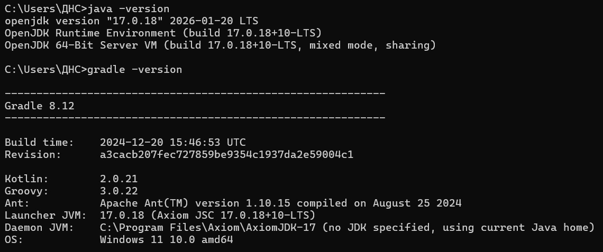
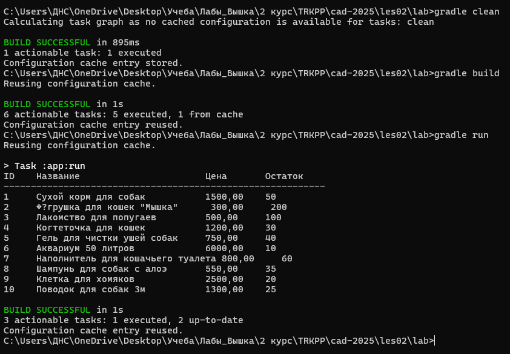

# Отчет о лабораторной работе №1

## Цель работы
Создание каркаса Spring-приложения 
с использованием Java-конфигурации, 
освоение инструмента сборки Gradle, 
реализация загрузчика CSV-файлов 
для последующего использования в проекте 
"Магазин товаров для животных".

## Выполнение работы
1. Скачаны дистрибутивы с официального сайта,
выполнена установка (Рис.1)


<div>Рисунок 1 - Установка дистрибутивов Axiom,
Gradle, Java</div>

2. С помощью команды gradle init --package ru.bsuedu.cad.lab
был создан каркас проекта
```
C:\Users\ДНС\OneDrive\Desktop\Учеба\Лабы_Вышка\2 курс\TRKPP\cad-2025\les02\lab>tree /F
Структура папок тома Windows
Серийный номер тома: 30D7-8BAE
C:.
│   .gitattributes
│   .gitignore
│   chcp
│   gradle.properties
│   gradlew
│   gradlew.bat
│   img.png
│   img_1.png
│   README.md
│   settings.gradle.kts
│
├───.gradle
│   │   file-system.probe
│   │
│   ├───8.12
│   │   │   gc.properties
│   │   │
│   │   ├───checksums
│   │   │       checksums.lock
│   │   │       sha1-checksums.bin
│   │   │
│   │   ├───executionHistory
│   │   │       executionHistory.bin
│   │   │       executionHistory.lock
│   │   │
│   │   ├───expanded
│   │   ├───fileChanges
│   │   │       last-build.bin
│   │   │
│   │   ├───fileHashes
│   │   │       fileHashes.bin
│   │   │       fileHashes.lock
│   │   │       resourceHashesCache.bin
│   │   │
│   │   └───vcsMetadata
│   ├───buildOutputCleanup
│   │       buildOutputCleanup.lock
│   │       cache.properties
│   │       outputFiles.bin
│   │
│   ├───configuration-cache
│   │   │   configuration-cache.lock
│   │   │   gc.properties
│   │   │
│   │   ├───16e5441e-8949-41bc-acc1-a1ad124e4aaa
│   │   ├───2140169b-d432-46ea-be6f-948321efb934
│   │   ├───2c06e9ca-f646-4912-9529-3961742fd0f7
│   │   ├───2tl9pqiqpko2nn9hckdirvs96
│   │   │       candidates.bin
│   │   │
│   │   ├───50d2e8bf-9d7f-4829-8d2c-768ce16171c9
│   │   │       buildfingerprint14356133803902752806.tmp
│   │   │       projectfingerprint16511343817481066798.tmp
│   │   │
│   │   ├───52f6b281-4ada-44c6-ada8-d0756d2ff257
│   │   ├───53087ba7-4678-4ed2-be84-bfdad458d9c5
│   │   │       .globals.work.bin
│   │   │       .strings.work.bin
│   │   │       buildfingerprint.bin
│   │   │       entry.bin
│   │   │       projectfingerprint.bin
│   │   │       work.bin
│   │   │       _app.work.bin
│   │   │
│   │   ├───569e3323-ec68-4c1a-9383-4f15477c3de1
│   │   │       .globals.work.bin
│   │   │       .strings.work.bin
│   │   │       buildfingerprint.bin
│   │   │       entry.bin
│   │   │       projectfingerprint.bin
│   │   │       work.bin
│   │   │       _app.work.bin
│   │   │
│   │   ├───5dfv431v5eyaso5n9bp1tl8th
│   │   │       candidates.bin
│   │   │
│   │   ├───8a346338-732d-475e-8580-b5b0333d52a0
│   │   │       .globals.work.bin
│   │   │       .strings.work.bin
│   │   │       buildfingerprint.bin
│   │   │       entry.bin
│   │   │       projectfingerprint.bin
│   │   │       work.bin
│   │   │       _app.work.bin
│   │   │
│   │   ├───8ess5m6xfuwebaf0uhp6mxjhv
│   │   │       candidates.bin
│   │   │
│   │   ├───b4mmk8zxx7bymqpg584d92k7k
│   │   │       candidates.bin
│   │   │
│   │   ├───bc6bf878-ce61-4af3-a57b-cb9a3ec5989e
│   │   ├───d725ae2b-33ff-4f53-a68c-5f98cc474187
│   │   │       buildfingerprint3416916585894245343.tmp
│   │   │       projectfingerprint12574739357746414784.tmp
│   │   │
│   │   ├───e00quq3r242coy7y0tf0q0ch1
│   │   │       candidates.bin
│   │   │
│   │   ├───f0e9e482-3b39-4d17-97d1-ead6d7e87c0c
│   │   ├───f4d89495-a0d0-4eb4-8eba-6ead9d651825
│   │   ├───f72f2004-79a7-46f0-862f-b4e3255fe2d4
│   │   ├───fa0ce4af-a10a-4a8c-9e04-5e96edbe097c
│   │   ├───fd69b166-8aad-49b1-9294-17935ec35bdb
│   │   │       .globals.work.bin
│   │   │       .strings.work.bin
│   │   │       build.work.bin
│   │   │       buildfingerprint.bin
│   │   │       entry.bin
│   │   │       projectfingerprint.bin
│   │   │       work.bin
│   │   │       _app.work.bin
│   │   │
│   │   └───fe7201b1-8856-4b01-8c93-6af8bf19d68d
│   │           .globals.work.bin
│   │           .strings.work.bin
│   │           buildfingerprint.bin
│   │           entry.bin
│   │           projectfingerprint.bin
│   │           work.bin
│   │           _app.work.bin
│   │
│   └───vcs-1
│           gc.properties
│
├───.idea
│       .gitignore
│       .name
│       compiler.xml
│       gradle.xml
│       misc.xml
│       vcs.xml
│       workspace.xml
│
├───app
│   │   build.gradle.kts
│   │
│   ├───build
│   │   ├───classes
│   │   │   └───java
│   │   │       └───main
│   │   │           └───ru
│   │   │               └───bsuedu
│   │   │                   └───cad
│   │   │                       └───lab
│   │   │                               App.class
│   │   │                               AppConfig.class
│   │   │                               ConcreteProductProvider.class
│   │   │                               ConsoleTableRenderer.class
│   │   │                               CSVParser.class
│   │   │                               Parser.class
│   │   │                               Product.class
│   │   │                               ProductProvider.class
│   │   │                               Reader.class
│   │   │                               Renderer.class
│   │   │                               ResourceFileReader.class
│   │   │
│   │   ├───distributions
│   │   │       app.tar
│   │   │       app.zip
│   │   │
│   │   ├───generated
│   │   │   └───sources
│   │   │       ├───annotationProcessor
│   │   │       │   └───java
│   │   │       │       └───main
│   │   │       └───headers
│   │   │           └───java
│   │   │               └───main
│   │   ├───libs
│   │   │       app.jar
│   │   │
│   │   ├───resources
│   │   │   └───main
│   │   │           product.csv
│   │   │
│   │   ├───scripts
│   │   │       app
│   │   │       app.bat
│   │   │
│   │   └───tmp
│   │       ├───compileJava
│   │       │       previous-compilation-data.bin
│   │       │
│   │       └───jar
│   │               MANIFEST.MF
│   │
│   └───src
│       ├───main
│       │   ├───java
│       │   │   └───ru
│       │   │       └───bsuedu
│       │   │           └───cad
│       │   │               └───lab
│       │   │                       App.java
│       │   │                       AppConfig.java
│       │   │                       ConcreteProductProvider.java
│       │   │                       ConsoleTableRenderer.java
│       │   │                       CSVParser.java
│       │   │                       Parser.java
│       │   │                       Product.java
│       │   │                       ProductProvider.java
│       │   │                       Reader.java
│       │   │                       Renderer.java
│       │   │                       ResourceFileReader.java
│       │   │
│       │   └───resources
│       │           product.csv
│       │
│       └───test
│           ├───java
│           │   └───ru
│           │       └───bsuedu
│           │           └───cad
│           │               └───lab
│           └───resources
├───build
│   └───reports
│       ├───configuration-cache
│       │   ├───2tl9pqiqpko2nn9hckdirvs96
│       │   │   ├───b7btww7fo7vjx9c01z65rrwis
│       │   │   │       configuration-cache-report.html
│       │   │   │
│       │   │   └───dbyliv8bexwt3rgt7z4fehi8v
│       │   │           configuration-cache-report.html
│       │   │
│       │   ├───5dfv431v5eyaso5n9bp1tl8th
│       │   │   ├───13w2mr9fd9iqlhfi6dck53ztk
│       │   │   │       configuration-cache-report.html
│       │   │   │
│       │   │   ├───1eymfrvoji3yflbkzdo16lexi
│       │   │   │       configuration-cache-report.html
│       │   │   │
│       │   │   ├───4mwgys6lc8orlg0zf11o1qg0i
│       │   │   │       configuration-cache-report.html
│       │   │   │
│       │   │   └───81xroynz209hw99p43y2k2y1u
│       │   │           configuration-cache-report.html
│       │   │
│       │   ├───7uuszb7thfu0tp61yksguosvz
│       │   │   └───c9s4jzkl3exzlyqasemd1vtns
│       │   │           configuration-cache-report.html
│       │   │
│       │   ├───8ess5m6xfuwebaf0uhp6mxjhv
│       │   │   └───6d41htdacq3vdxi3758at5gka
│       │   │           configuration-cache-report.html
│       │   │
│       │   ├───b4mmk8zxx7bymqpg584d92k7k
│       │   │   ├───59kbqza7rzyw3bopaorxdez6o
│       │   │   │       configuration-cache-report.html
│       │   │   │
│       │   │   ├───63x9jra732emu882hedrvdqva
│       │   │   │       configuration-cache-report.html
│       │   │   │
│       │   │   ├───a253aqwuwsc81ze6a0ssy7avk
│       │   │   │       configuration-cache-report.html
│       │   │   │
│       │   │   └───cnndk4weowvf4ztsd5vm7666u
│       │   │           configuration-cache-report.html
│       │   │
│       │   └───e00quq3r242coy7y0tf0q0ch1
│       │       ├───27nyf6gfkmgohkdw35spl5vx1
│       │       │       configuration-cache-report.html
│       │       │
│       │       └───811g215bucbfbrn6hqyqx5r63
│       │               configuration-cache-report.html
│       │
│       └───problems
│               problems-report.html
│
└───gradle
    │   libs.versions.toml
    │
    ├───.idea
    │   │   gradle.iml
    │   │   misc.xml
    │   │   modules.xml
    │   │   vcs.xml
    │   │   workspace.xml
    │   │
    │   └───libraries
    │           gradle_wrapper.xml
    │
    └───wrapper
            gradle-wrapper.jar
            gradle-wrapper.properties
```
3. Добавлена библиотека *org.springframework:spring-context:6.2.2*
## Реализация
Класс Product
```
package ru.bsuedu.cad.lab;

public class Product {
    private long id;
    private String name;
    private String description;
    private double price;
    private int stockQuantity;

    public Product(long id, String name, String description,
                   double price, int stockQuantity) {
        this.id = id;
        this.name = name;
        this.description = description;
        this.price = price;
        this.stockQuantity = stockQuantity;
    }

    public long getId() { return id; }
    public String getName() { return name; }
    public String getDescription() { return description; }
    public double getPrice() { return price; }
    public int getStockQuantity() { return stockQuantity; }
}
```

Файл build.gradle
```
/*
* This file was generated by the Gradle 'init' task.
*
* This generated file contains a sample Java application project to get you started.
* For more details on building Java & JVM projects, please refer to https://docs.gradle.org/8.12/userguide/building_java_projects.html in the Gradle documentation.
* This project uses @Incubating APIs which are subject to change.
  */

plugins {
// Apply the application plugin to add support for building a CLI application in Java.
application
}

repositories {
// Use Maven Central for resolving dependencies.
mavenCentral()
}

dependencies {
// This dependency is used by the application.
implementation(libs.guava)
// Source: https://mvnrepository.com/artifact/org.springframework/spring-context
implementation("org.springframework:spring-context:6.2.2")
}

testing {
suites {
// Configure the built-in test suite
val test by getting(JvmTestSuite::class) {
// Use JUnit Jupiter test framework
useJUnitJupiter("5.11.1")
}
}
}

// Apply a specific Java toolchain to ease working on different environments.
java {
toolchain {
languageVersion = JavaLanguageVersion.of(17)
}
}

application {
// Define the main class for the application.
mainClass = "ru.bsuedu.cad.lab.App"
}

tasks.withType<JavaExec> {
jvmArgs("-Dfile.encoding=UTF-8")
standardOutput = System.out
errorOutput = System.err
}
tasks.withType<JavaCompile> {
options.encoding = "UTF-8"
}

```
Конфигурация приложения AppConfig
```
package ru.bsuedu.cad.lab;

import org.springframework.context.annotation.Bean;
import org.springframework.context.annotation.Configuration;

@Configuration
public class AppConfig
{
    @Bean
    public Reader reader() {
        return new ResourceFileReader("product.csv");
    }

    @Bean
    public Parser parser() {
        return new CSVParser();
    }

    @Bean
    public ProductProvider productProvider(
            Reader reader,
            Parser parser
    ) {
        return new ConcreteProductProvider(reader, parser);
    }

    @Bean
    public Renderer renderer() {
        return new ConsoleTableRenderer();
    }
}

```
## Результат работы


## Выводы
В ходе выполнения работы был создан 
базовый каркас Spring-приложения для 
магазина товаров для животных. 
Освоены инструменты Gradle 8.12 и JDK 17, 
реализована Java-конфигурация Spring-контекста. 
Разработаны основные компоненты согласно 
диаграмме классов: Reader для чтения 
CSV-файла из ресурсов, 
Parser для парсинга данных, 
ProductProvider для предоставления 
списка товаров и Renderer для вывода 
таблицы в консоль.

Приложение успешно запускается командой gradle run, 
читает данные из product.csv и 
корректно отображает их в виде 
форматированной таблицы.