# Отчет о лабораторной работе №3
## Выполнение работы
1. Новый класс CategoryFileReader
```
package ru.bsuedu.cad.lab;

import jakarta.annotation.PostConstruct;
import org.springframework.beans.factory.annotation.Value;
import org.springframework.stereotype.Component;

import java.io.BufferedReader;
import java.io.InputStream;
import java.io.InputStreamReader;
import java.time.LocalDateTime;
import java.util.List;

@Component("categoryFileReader")
public class CategoryFileReader implements Reader {

    @Value("${category.file}")
    private String filename;

    @PostConstruct
    public void init() {
        System.out.println("CategoryFileReader инициализирован: " + LocalDateTime.now());
    }

    @Override
    public List<String> read() {
        try (InputStream is = getClass().getClassLoader().getResourceAsStream(filename);
             BufferedReader reader = new BufferedReader(new InputStreamReader(is))) {
            return reader.lines().toList();
        } catch (Exception e) {
            throw new RuntimeException("Ошибка чтения файла " + filename, e);
        }
    }
}
```
2. Новый класс CategoryRequest
```
package ru.bsuedu.cad.lab;

import org.slf4j.Logger;
import org.slf4j.LoggerFactory;
import org.springframework.stereotype.Component;

import javax.sql.DataSource;
import java.sql.Connection;
import java.sql.PreparedStatement;
import java.sql.ResultSet;

@Component
public class CategoryRequest {

    private static final Logger logger = LoggerFactory.getLogger(CategoryRequest.class);
    private final DataSource dataSource;

    public CategoryRequest(DataSource dataSource) {
        this.dataSource = dataSource;
    }

    public void execute() {
        String sql = """
            SELECT c.NAME, COUNT(p.ID) AS CNT
            FROM CATEGORIES c
            JOIN PRODUCTS p ON c.ID = p.CATEGORY_ID
            GROUP BY c.NAME
            HAVING COUNT(p.ID) > 1
        """;

        try (Connection conn = dataSource.getConnection();
             PreparedStatement ps = conn.prepareStatement(sql);
             ResultSet rs = ps.executeQuery()) {

            while (rs.next()) {
                logger.info("Категория: {} | Количество товаров: {}", rs.getString("NAME"), rs.getInt("CNT"));
            }

        } catch (Exception e) {
            throw new RuntimeException("Ошибка запроса категорий", e);
        }
    }
}
```
3. Новый файл ConcreteCategoryProvider
```
package ru.bsuedu.cad.lab;

import org.springframework.beans.factory.annotation.Qualifier;
import org.springframework.stereotype.Component;

import java.util.List;

@Component
public class ConcreteCategoryProvider {

    private final Reader reader;

    public ConcreteCategoryProvider(@Qualifier("categoryFileReader") Reader reader) {
        this.reader = reader;
    }

    public List<Category> getCategories() {
        return reader.read().stream()
                .skip(1)
                .filter(line -> !line.isBlank())
                .map(line -> {
                    String[] parts = line.split(",");
                    return new Category(
                            Long.parseLong(parts[0].trim()),
                            parts[1].trim(),
                            parts[2].trim()
                    );
                })
                .toList();
    }
}
```
4. Новый класс DataBaseRenderer
```
package ru.bsuedu.cad.lab;

import org.springframework.context.annotation.Primary;
import org.springframework.stereotype.Component;

import javax.sql.DataSource;
import java.sql.Connection;
import java.sql.PreparedStatement;
import java.util.List;

@Component
@Primary
public class DataBaseRenderer implements Renderer {

    private final DataSource dataSource;
    private final ConcreteCategoryProvider categoryProvider;

    public DataBaseRenderer(DataSource dataSource, ConcreteCategoryProvider categoryProvider) {
        this.dataSource = dataSource;
        this.categoryProvider = categoryProvider;
    }

    @Override
    public void render(List<Product> products) {
        try (Connection conn = dataSource.getConnection()) {
            
            String sqlCat = "INSERT INTO CATEGORIES(ID, NAME, DESCRIPTION) VALUES (?, ?, ?)";
            try (PreparedStatement ps = conn.prepareStatement(sqlCat)) {
                for (Category c : categoryProvider.getCategories()) {
                    ps.setLong(1, c.getId());
                    ps.setString(2, c.getName());
                    ps.setString(3, c.getDescription());
                    ps.addBatch();
                }
                ps.executeBatch();
            }
            
            String sqlProd = "INSERT INTO PRODUCTS(ID, NAME, DESCRIPTION, PRICE, STOCK_QUANTITY, CATEGORY_ID) VALUES (?, ?, ?, ?, ?, ?)";
            try (PreparedStatement ps = conn.prepareStatement(sqlProd)) {
                for (Product p : products) {
                    ps.setLong(1, p.getId());
                    ps.setString(2, p.getName());
                    ps.setString(3, p.getDescription());
                    ps.setDouble(4, p.getPrice());
                    ps.setInt(5, p.getStockQuantity());
                    ps.setLong(6, p.getCategoryId());
                    ps.addBatch();
                }
                ps.executeBatch();
            }

            System.out.println("Данные сохранены в H2");

        } catch (Exception e) {
            throw new RuntimeException(e);
        }
    }
}
```
5. Сборка проекта
```
15:21:31: Executing 'run'…

Reusing configuration cache.
> Task :app:processResources
> Task :app:compileJava
> Task :app:classes

> Task :app:run
CategoryFileReader инициализирован: 2026-03-02T15:21:32.092893800
15:21:32 INFO  - Starting embedded database: url='jdbc:h2:mem:testdb;DB_CLOSE_DELAY=-1;DB_CLOSE_ON_EXIT=false', username='sa'
ResourceFileReader инициализирован: 2026-03-02T15:21:32.280977900
Данные сохранены в H2
15:21:32 INFO  - Категория: Средства ухода | Количество товаров: 2

BUILD SUCCESSFUL in 1s
3 actionable tasks: 3 executed
Configuration cache entry reused.
15:21:32: Execution finished 'run'.

```

## Результат работы
Обновленная диаграмма классов Mermaid

```mermaid
classDiagram

%% ========================
%% Основные классы
%% ========================

    class App {
        +main(String[] args)
    }

    class AppConfig {
        +dataSource() DataSource
    }

%% ========================
%% Сущности
%% ========================

    class Product {
        -long id
        -String name
        -String description
        -double price
        -int stockQuantity
        -long categoryId
    }

    class Category {
        -long id
        -String name
        -String description
    }

%% ========================
%% Интерфейсы
%% ========================

    class Reader {
        <<interface>>
        +read() List~String~
    }

    class Parser {
        <<interface>>
        +parse(List~String~) List~Product~
    }

    class Renderer {
        <<interface>>
        +render(List~Product~)
    }

    class ProductProvider {
        <<interface>>
        +getProducts() List~Product~
    }

%% ========================
%% Реализации Reader
%% ========================

    class ResourceFileReader {
        -String filename
        +read() List~String~
    }

    class CategoryFileReader {
        -String filename
        +read() List~String~
    }

    Reader <|.. ResourceFileReader
    Reader <|.. CategoryFileReader

%% ========================
%% Реализация Parser
%% ========================

    class CSVParser {
        +parse(List~String~) List~Product~
    }

    Parser <|.. CSVParser

    class ConcreteProductProvider {
        -Reader reader
        -Parser parser
        +getProducts() List~Product~
    }

    ProductProvider <|.. ConcreteProductProvider
    ConcreteProductProvider --> Reader
    ConcreteProductProvider --> Parser


    class ConcreteCategoryProvider {
        -Reader reader
        +getCategories() List~Category~
    }

    ConcreteCategoryProvider --> Reader
    ConcreteCategoryProvider --> Category


    class ConsoleTableRenderer {
        +render(List~Product~)
    }

    class HTMLTableRenderer {
        +render(List~Product~)
    }

    class DataBaseRenderer {
        -DataSource dataSource
        -ConcreteCategoryProvider categoryProvider
        +render(List~Product~)
    }

    Renderer <|.. ConsoleTableRenderer
    Renderer <|.. HTMLTableRenderer
    Renderer <|.. DataBaseRenderer

    DataBaseRenderer --> ConcreteCategoryProvider
    DataBaseRenderer --> Product
    DataBaseRenderer --> Category


    class CategoryRequest {
        -DataSource dataSource
        +execute()
    }

    class ParsingTimeAspect {
        +measureTime(ProceedingJoinPoint)
    }

    ParsingTimeAspect ..> CSVParser
    App --> ProductProvider
    App --> Renderer
    App --> CategoryRequest
    App --> AppConfig
```
