# Отчет о лабораторной работе №4
## Выполнение работы
1. Класс OrderApplication
```
package ru.bsuedu.cad.lab.app;

import org.slf4j.Logger;
import org.slf4j.LoggerFactory;
import org.springframework.context.annotation.AnnotationConfigApplicationContext;
import ru.bsuedu.cad.lab.config.AppConfig;
import ru.bsuedu.cad.lab.entity.Category;
import ru.bsuedu.cad.lab.entity.Customer;
import ru.bsuedu.cad.lab.entity.Order;
import ru.bsuedu.cad.lab.entity.Product;
import ru.bsuedu.cad.lab.repository.CategoryRepository;
import ru.bsuedu.cad.lab.repository.CustomerRepository;
import ru.bsuedu.cad.lab.repository.OrderRepository;
import ru.bsuedu.cad.lab.repository.ProductRepository;
import ru.bsuedu.cad.lab.service.DataLoaderService;
import ru.bsuedu.cad.lab.service.OrderService;

import java.math.BigDecimal;
import java.util.Arrays;
import java.util.List;

public class OrderApplication {
    private static final Logger logger = LoggerFactory.getLogger(OrderApplication.class);

    public static void main(String[] args) {
        logger.info("==========================================");
        logger.info("Запуск приложения");
        logger.info("==========================================");

        try (AnnotationConfigApplicationContext context =
                     new AnnotationConfigApplicationContext(AppConfig.class)) {

            DataLoaderService dataLoaderService = context.getBean(DataLoaderService.class);
            OrderService orderService = context.getBean(OrderService.class);
            CategoryRepository categoryRepository = context.getBean(CategoryRepository.class);
            CustomerRepository customerRepository = context.getBean(CustomerRepository.class);
            ProductRepository productRepository = context.getBean(ProductRepository.class);
            OrderRepository orderRepository = context.getBean(OrderRepository.class);

            logger.info("Загрузка начальных данных из CSV файлов...");
            dataLoaderService.loadAllData();

            logger.info("==========================================");
            logger.info("ЗАГРУЖЕННЫЕ ДАННЫЕ:");
            logger.info("==========================================");

            List<Category> categories = categoryRepository.findAll();
            logger.info("Категории ({}):", categories.size());
            for (Category c : categories) {
                logger.info("  {} - {}", c.getId(), c.getName());
            }

            List<Customer> customers = customerRepository.findAll();
            logger.info("Клиенты ({}):", customers.size());
            for (Customer c : customers) {
                logger.info("  {} - {} ({})", c.getId(), c.getName(), c.getEmail());
            }

            List<Product> products = productRepository.findAll();
            logger.info("Товары ({}):", products.size());
            for (Product p : products) {
                logger.info("  {} - {} ({} руб.) - остаток: {}",
                        p.getId(), p.getName(), p.getPrice(), p.getStockQuantity());
            }

            logger.info("==========================================");
            logger.info("СОЗДАНИЕ НОВОГО ЗАКАЗА:");
            logger.info("==========================================");

            Customer customer = customers.get(0);
            logger.info("Клиент: {} ({})", customer.getName(), customer.getEmail());
            logger.info("Адрес доставки: {}", customer.getAddress());

            List<OrderService.OrderItemRequest> items = Arrays.asList(
                    new OrderService.OrderItemRequest(products.get(0).getId(), 1), // Сухой корм для собак
                    new OrderService.OrderItemRequest(products.get(1).getId(), 2), // Игрушка для кошек
                    new OrderService.OrderItemRequest(products.get(2).getId(), 1)  // Лакомство для попугаев
            );

            logger.info("Состав заказа:");
            for (OrderService.OrderItemRequest item : items) {
                Product p = findProductById(products, item.getProductId());
                BigDecimal itemTotal = p.getPrice().multiply(BigDecimal.valueOf(item.getQuantity()));
                logger.info("  - {}: {} x {} руб. = {} руб.",
                        p.getName(),
                        item.getQuantity(),
                        p.getPrice(),
                        itemTotal);
            }

            Order newOrder = orderService.createOrder(
                    customer.getId(),
                    items,
                    customer.getAddress()
            );

            logger.info("==========================================");
            logger.info("ЗАКАЗ УСПЕШНО СОЗДАН!");
            logger.info("==========================================");
            logger.info("Номер заказа: {}", newOrder.getId());
            logger.info("Дата заказа: {}", newOrder.getOrderDate());
            logger.info("Статус: {}", newOrder.getStatus());
            logger.info("Общая сумма: {} руб.", newOrder.getTotalPrice());
            logger.info("Клиент: {}", newOrder.getCustomer().getName());
            logger.info("Адрес доставки: {}", newOrder.getShippingAddress());
            logger.info("Детали заказа:");

            newOrder.getOrderDetails().size();
            for (var detail : newOrder.getOrderDetails()) {
                detail.getProduct().getName();
                logger.info("  - {}: {} x {} руб. = {} руб.",
                        detail.getProduct().getName(),
                        detail.getQuantity(),
                        detail.getPrice(),
                        detail.getSubtotal());
            }

            logger.info("==========================================");
            logger.info("ПРОВЕРКА СОХРАНЕНИЯ ЗАКАЗА:");
            logger.info("==========================================");

            List<Order> allOrders = orderService.getAllOrders();
            logger.info("Всего заказов в базе данных: {}", allOrders.size());

            for (Order o : allOrders) {
                logger.info("Заказ #{} от {} на сумму {} руб. ({}):",
                        o.getId(), o.getOrderDate(), o.getTotalPrice(), o.getStatus());

                o.getOrderDetails().size();
                for (var d : o.getOrderDetails()) {
                    d.getProduct().getName();
                    logger.info("    - {}: {} x {} руб.",
                            d.getProduct().getName(), d.getQuantity(), d.getPrice());
                }
            }

            logger.info("==========================================");
            logger.info("ОБНОВЛЕНИЕ ОСТАТКОВ ТОВАРОВ:");
            logger.info("==========================================");

            List<Product> updatedProducts = productRepository.findAll();
            for (Product p : updatedProducts) {
                logger.info("Товар '{}': новый остаток = {}",
                        p.getName(), p.getStockQuantity());
            }

            logger.info("==========================================");
            logger.info("Приложение успешно завершено!");
            logger.info("==========================================");

        } catch (Exception e) {
            logger.error("Ошибка при выполнении", e);
            System.exit(1);
        }
    }

    private static Product findProductById(List<Product> products, Long productId) {
        for (Product p : products) {
            if (p.getId().equals(productId)) {
                return p;
            }
        }
        throw new RuntimeException("Продукт не найден с ID: " + productId);
    }
}
```
2. Диаграмма классов

```mermaid
classDiagram
    class Category {
        -Long id
        -String name
        -String description
        -List~Product~ products
        +Category()
        +Category(String, String)
    }
    
    class Product {
        -Long id
        -String name
        -String description
        -Category category
        -BigDecimal price
        -Integer stockQuantity
        -String imageUrl
        -LocalDateTime createdAt
        -LocalDateTime updatedAt
        -List~OrderDetail~ orderDetails
        +Product()
        +Product(String, String, Category, BigDecimal, Integer, String)
        +onUpdate()
    }
    
    class Customer {
        -Long id
        -String name
        -String email
        -String phone
        -String address
        -List~Order~ orders
        +Customer()
        +Customer(String, String, String, String)
    }
    
    class Order {
        -Long id
        -Customer customer
        -LocalDateTime orderDate
        -BigDecimal totalPrice
        -String status
        -String shippingAddress
        -List~OrderDetail~ orderDetails
        +Order()
        +Order(Customer, String)
        +addOrderDetail(OrderDetail)
        +removeOrderDetail(OrderDetail)
        -calculateTotalPrice()
    }
    
    class OrderDetail {
        -Long id
        -Order order
        -Product product
        -Integer quantity
        -BigDecimal price
        +OrderDetail()
        +OrderDetail(Product, Integer)
        +getSubtotal() BigDecimal
    }
    
    class CategoryRepository {
        <<interface>>
        +save(Category) Category
        +findById(Long) Optional~Category~
        +findAll() List~Category~
    }
    
    class ProductRepository {
        <<interface>>
        +save(Product) Product
        +findById(Long) Optional~Product~
        +findAll() List~Product~
        +findByCategoryId(Long) List~Product~
    }
    
    class CustomerRepository {
        <<interface>>
        +save(Customer) Customer
        +findById(Long) Optional~Customer~
        +findByEmail(String) Optional~Customer~
        +findAll() List~Customer~
    }
    
    class OrderRepository {
        <<interface>>
        +save(Order) Order
        +findById(Long) Optional~Order~
        +findAll() List~Order~
        +findByCustomerId(Long) List~Order~
    }
    
    class OrderDetailRepository {
        <<interface>>
        +save(OrderDetail) OrderDetail
        +findById(Long) Optional~OrderDetail~
        +findAll() List~OrderDetail~
        +findByOrderId(Long) List~OrderDetail~
    }
    
    class OrderService {
        -OrderRepository orderRepository
        -OrderDetailRepository orderDetailRepository
        -CustomerRepository customerRepository
        -ProductRepository productRepository
        +OrderService(OrderRepository, OrderDetailRepository, CustomerRepository, ProductRepository)
        +createOrder(Long, List~OrderItemRequest~, String) Order
        +getAllOrders() List~Order~
        +getOrderById(Long) Order
    }
    
    class DataLoaderService {
        -CategoryRepository categoryRepository
        -CustomerRepository customerRepository
        -ProductRepository productRepository
        -Map~Long, Category~ categoryMap
        -Map~Long, Customer~ customerMap
        +DataLoaderService(CategoryRepository, CustomerRepository, ProductRepository)
        +loadAllData()
        +loadCategories()
        +loadCustomers()
        +loadProducts()
        -getValue(CSVRecord, Map, String) String
    }
    
    class OrderApplication {
        +main(String[])
        -findProductById(List~Product~, Long) Product
    }
    
    class OrderItemRequest {
        -Long productId
        -Integer quantity
        +OrderItemRequest(Long, Integer)
    }
    
    Category "1" --o "many" Product : содержит
    Customer "1" --o "many" Order : размещает
    Order "1" --o "many" OrderDetail : содержит
    Product "1" --o "many" OrderDetail : включен в
    OrderService --> OrderRepository : использует
    OrderService --> CustomerRepository : использует
    OrderService --> ProductRepository : использует
    OrderService --> OrderDetailRepository : использует
    DataLoaderService --> CategoryRepository : использует
    DataLoaderService --> CustomerRepository : использует
    DataLoaderService --> ProductRepository : использует
    OrderApplication --> OrderService : использует
    OrderApplication --> DataLoaderService : использует
    OrderService --> OrderItemRequest : создает
```

3. Конфигурация проекта build.gradle
```
plugins {
    id("java")
    id("application")
}

group = "ru.bsuedu.cad.lab"
version = "1.0-SNAPSHOT"

repositories {
    mavenCentral()
}

dependencies {
    // Spring
    implementation("org.springframework:spring-context:6.1.3")
    implementation("org.springframework:spring-orm:6.1.3")
    implementation("org.springframework.data:spring-data-jpa:3.2.3")
    
    // Hibernate
    implementation("org.hibernate.orm:hibernate-core:6.4.2.Final")
    implementation("org.hibernate.orm:hibernate-hikaricp:6.4.2.Final")
    
    // HikariCP
    implementation("com.zaxxer:HikariCP:5.1.0")
    
    // H2 Database
    implementation("com.h2database:h2:2.2.224")
    
    // Logging
    implementation("org.slf4j:slf4j-api:2.0.12")
    implementation("ch.qos.logback:logback-classic:1.5.0")
    
    // CSV Parsing
    implementation("org.apache.commons:commons-csv:1.10.0")
    
    // JPA Annotation
    implementation("jakarta.persistence:jakarta.persistence-api:3.1.0")
    implementation("jakarta.transaction:jakarta.transaction-api:2.0.1")
    
    // Testing
    testImplementation(platform("org.junit:junit-bom:5.10.0"))
    testImplementation("org.junit.jupiter:junit-jupiter")
}

application {
    mainClass.set("ru.bsuedu.cad.lab.app.OrderApplication")
}
```
## Результат
```
22:40:48: Executing 'run'…

Reusing configuration cache.
> Task :app:processResources UP-TO-DATE
> Task :app:compileJava
> Task :app:classes

> Task :app:run
22:40:49.940 [main] INFO  r.b.cad.lab.app.OrderApplication - ==========================================
22:40:49.943 [main] INFO  r.b.cad.lab.app.OrderApplication - Запуск приложения
22:40:49.944 [main] INFO  r.b.cad.lab.app.OrderApplication - ==========================================
22:40:50.387 [main] INFO  o.s.d.r.c.RepositoryConfigurationDelegate - Bootstrapping Spring Data JPA repositories in DEFAULT mode.
22:40:50.419 [main] INFO  o.s.d.r.c.RepositoryConfigurationDelegate - Finished Spring Data repository scanning in 16 ms. Found 0 JPA repository interfaces.
22:40:50.814 [main] INFO  com.zaxxer.hikari.HikariDataSource - HikariPool-1 - Starting...
22:40:51.057 [main] INFO  com.zaxxer.hikari.pool.HikariPool - HikariPool-1 - Added connection conn0: url=jdbc:h2:mem:zoostore user=SA
22:40:51.060 [main] INFO  com.zaxxer.hikari.HikariDataSource - HikariPool-1 - Start completed.
22:40:51.166 [main] INFO  o.h.jpa.internal.util.LogHelper - HHH000204: Processing PersistenceUnitInfo [name: default]
22:40:51.244 [main] INFO  org.hibernate.Version - HHH000412: Hibernate ORM core version 6.4.2.Final
22:40:51.295 [main] INFO  o.h.c.i.RegionFactoryInitiator - HHH000026: Second-level cache disabled
22:40:51.729 [main] INFO  o.s.o.j.p.SpringPersistenceUnitInfo - No LoadTimeWeaver setup: ignoring JPA class transformer
22:40:51.783 [main] WARN  org.hibernate.orm.deprecation - HHH90000025: H2Dialect does not need to be specified explicitly using 'hibernate.dialect' (remove the property setting and it will be selected by default)
22:40:53.016 [main] INFO  o.h.e.t.j.p.i.JtaPlatformInitiator - HHH000489: No JTA platform available (set 'hibernate.transaction.jta.platform' to enable JTA platform integration)
22:40:53.036 [main] DEBUG org.hibernate.SQL - 
    drop table if exists CATEGORIES cascade 
Hibernate: 
    drop table if exists CATEGORIES cascade 
22:40:53.041 [main] DEBUG org.hibernate.SQL - 
    drop table if exists CUSTOMERS cascade 
Hibernate: 
    drop table if exists CUSTOMERS cascade 
22:40:53.041 [main] DEBUG org.hibernate.SQL - 
    drop table if exists ORDER_DETAILS cascade 
Hibernate: 
    drop table if exists ORDER_DETAILS cascade 
22:40:53.041 [main] DEBUG org.hibernate.SQL - 
    drop table if exists ORDERS cascade 
Hibernate: 
    drop table if exists ORDERS cascade 
22:40:53.042 [main] DEBUG org.hibernate.SQL - 
    drop table if exists PRODUCTS cascade 
Hibernate: 
    drop table if exists PRODUCTS cascade 
22:40:53.047 [main] DEBUG org.hibernate.SQL - 
    create table CATEGORIES (
        category_id bigint generated by default as identity,
        name varchar(100) not null,
        description varchar(500),
        primary key (category_id)
    )
Hibernate: 
    create table CATEGORIES (
        category_id bigint generated by default as identity,
        name varchar(100) not null,
        description varchar(500),
        primary key (category_id)
    )
22:40:53.059 [main] DEBUG org.hibernate.SQL - 
    create table CUSTOMERS (
        customer_id bigint generated by default as identity,
        phone varchar(20),
        email varchar(100) not null unique,
        name varchar(100) not null,
        address varchar(500),
        primary key (customer_id)
    )
Hibernate: 
    create table CUSTOMERS (
        customer_id bigint generated by default as identity,
        phone varchar(20),
        email varchar(100) not null unique,
        name varchar(100) not null,
        address varchar(500),
        primary key (customer_id)
    )
22:40:53.063 [main] DEBUG org.hibernate.SQL - 
    create table ORDER_DETAILS (
        price numeric(10,2) not null,
        quantity integer not null,
        order_detail_id bigint generated by default as identity,
        order_id bigint not null,
        product_id bigint not null,
        primary key (order_detail_id)
    )
Hibernate: 
    create table ORDER_DETAILS (
        price numeric(10,2) not null,
        quantity integer not null,
        order_detail_id bigint generated by default as identity,
        order_id bigint not null,
        product_id bigint not null,
        primary key (order_detail_id)
    )
22:40:53.064 [main] DEBUG org.hibernate.SQL - 
    create table ORDERS (
        total_price numeric(10,2) not null,
        customer_id bigint not null,
        order_date timestamp(6) not null,
        order_id bigint generated by default as identity,
        status varchar(50) not null,
        shipping_address varchar(500),
        primary key (order_id)
    )
Hibernate: 
    create table ORDERS (
        total_price numeric(10,2) not null,
        customer_id bigint not null,
        order_date timestamp(6) not null,
        order_id bigint generated by default as identity,
        status varchar(50) not null,
        shipping_address varchar(500),
        primary key (order_id)
    )
22:40:53.066 [main] DEBUG org.hibernate.SQL - 
    create table PRODUCTS (
        price numeric(10,2) not null,
        stock_quantity integer not null,
        category_id bigint not null,
        created_at timestamp(6),
        product_id bigint generated by default as identity,
        updated_at timestamp(6),
        name varchar(200) not null,
        image_url varchar(500),
        description varchar(1000),
        primary key (product_id)
    )
Hibernate: 
    create table PRODUCTS (
        price numeric(10,2) not null,
        stock_quantity integer not null,
        category_id bigint not null,
        created_at timestamp(6),
        product_id bigint generated by default as identity,
        updated_at timestamp(6),
        name varchar(200) not null,
        image_url varchar(500),
        description varchar(1000),
        primary key (product_id)
    )
22:40:53.069 [main] DEBUG org.hibernate.SQL - 
    alter table if exists ORDER_DETAILS 
       add constraint FK8wdku4h4c96gwubj09an8bby6 
       foreign key (order_id) 
       references ORDERS
Hibernate: 
    alter table if exists ORDER_DETAILS 
       add constraint FK8wdku4h4c96gwubj09an8bby6 
       foreign key (order_id) 
       references ORDERS
22:40:53.083 [main] DEBUG org.hibernate.SQL - 
    alter table if exists ORDER_DETAILS 
       add constraint FKpshg2yc6vr6npa8jkbryetxrx 
       foreign key (product_id) 
       references PRODUCTS
Hibernate: 
    alter table if exists ORDER_DETAILS 
       add constraint FKpshg2yc6vr6npa8jkbryetxrx 
       foreign key (product_id) 
       references PRODUCTS
22:40:53.086 [main] DEBUG org.hibernate.SQL - 
    alter table if exists ORDERS 
       add constraint FK1nbewmmir6psft27yfvvmwpfg 
       foreign key (customer_id) 
       references CUSTOMERS
Hibernate: 
    alter table if exists ORDERS 
       add constraint FK1nbewmmir6psft27yfvvmwpfg 
       foreign key (customer_id) 
       references CUSTOMERS
22:40:53.089 [main] DEBUG org.hibernate.SQL - 
    alter table if exists PRODUCTS 
       add constraint FK860uwmfahxkeahlm8a800vmnb 
       foreign key (category_id) 
       references CATEGORIES
Hibernate: 
    alter table if exists PRODUCTS 
       add constraint FK860uwmfahxkeahlm8a800vmnb 
       foreign key (category_id) 
       references CATEGORIES
22:40:53.095 [main] INFO  o.s.o.j.LocalContainerEntityManagerFactoryBean - Initialized JPA EntityManagerFactory for persistence unit 'default'
22:40:53.323 [main] INFO  r.b.cad.lab.app.OrderApplication - Загрузка начальных данных из CSV файлов...
22:40:53.382 [main] INFO  r.b.c.lab.service.DataLoaderService - Загрузка CSV-файлов...
22:40:53.383 [main] INFO  r.b.c.lab.service.DataLoaderService - Загрузка категорий...
22:40:53.392 [main] DEBUG r.b.c.lab.service.DataLoaderService - Category CSV Headers: [category_id, description, name]
22:40:53.428 [main] DEBUG org.hibernate.SQL - 
    insert 
    into
        CATEGORIES
        (description, name, category_id) 
    values
        (?, ?, default)
Hibernate: 
    insert 
    into
        CATEGORIES
        (description, name, category_id) 
    values
        (?, ?, default)
22:40:53.469 [main] DEBUG r.b.c.lab.service.DataLoaderService - Загружены категории: 1 - Корма
22:40:53.470 [main] DEBUG org.hibernate.SQL - 
    insert 
    into
        CATEGORIES
        (description, name, category_id) 
    values
        (?, ?, default)
Hibernate: 
    insert 
    into
        CATEGORIES
        (description, name, category_id) 
    values
        (?, ?, default)
22:40:53.471 [main] DEBUG r.b.c.lab.service.DataLoaderService - Загружены категории: 2 - Игрушки
22:40:53.472 [main] DEBUG org.hibernate.SQL - 
    insert 
    into
        CATEGORIES
        (description, name, category_id) 
    values
        (?, ?, default)
Hibernate: 
    insert 
    into
        CATEGORIES
        (description, name, category_id) 
    values
        (?, ?, default)
22:40:53.473 [main] DEBUG r.b.c.lab.service.DataLoaderService - Загружены категории: 3 - Лакомства
22:40:53.474 [main] DEBUG org.hibernate.SQL - 
    insert 
    into
        CATEGORIES
        (description, name, category_id) 
    values
        (?, ?, default)
Hibernate: 
    insert 
    into
        CATEGORIES
        (description, name, category_id) 
    values
        (?, ?, default)
22:40:53.475 [main] DEBUG r.b.c.lab.service.DataLoaderService - Загружены категории: 4 - Аксессуары
22:40:53.475 [main] DEBUG org.hibernate.SQL - 
    insert 
    into
        CATEGORIES
        (description, name, category_id) 
    values
        (?, ?, default)
Hibernate: 
    insert 
    into
        CATEGORIES
        (description, name, category_id) 
    values
        (?, ?, default)
22:40:53.476 [main] DEBUG r.b.c.lab.service.DataLoaderService - Загружены категории: 5 - Средства ухода
22:40:53.477 [main] DEBUG org.hibernate.SQL - 
    insert 
    into
        CATEGORIES
        (description, name, category_id) 
    values
        (?, ?, default)
Hibernate: 
    insert 
    into
        CATEGORIES
        (description, name, category_id) 
    values
        (?, ?, default)
22:40:53.478 [main] DEBUG r.b.c.lab.service.DataLoaderService - Загружены категории: 6 - Аквариумистика
22:40:53.479 [main] DEBUG org.hibernate.SQL - 
    insert 
    into
        CATEGORIES
        (description, name, category_id) 
    values
        (?, ?, default)
Hibernate: 
    insert 
    into
        CATEGORIES
        (description, name, category_id) 
    values
        (?, ?, default)
22:40:53.480 [main] DEBUG r.b.c.lab.service.DataLoaderService - Загружены категории: 7 - Наполнители
22:40:53.481 [main] DEBUG org.hibernate.SQL - 
    insert 
    into
        CATEGORIES
        (description, name, category_id) 
    values
        (?, ?, default)
Hibernate: 
    insert 
    into
        CATEGORIES
        (description, name, category_id) 
    values
        (?, ?, default)
22:40:53.484 [main] DEBUG r.b.c.lab.service.DataLoaderService - Загружены категории: 8 - Клетки
22:40:53.486 [main] DEBUG org.hibernate.SQL - 
    insert 
    into
        CATEGORIES
        (description, name, category_id) 
    values
        (?, ?, default)
Hibernate: 
    insert 
    into
        CATEGORIES
        (description, name, category_id) 
    values
        (?, ?, default)
22:40:53.488 [main] DEBUG r.b.c.lab.service.DataLoaderService - Загружены категории: 9 - Амуниция
22:40:53.489 [main] DEBUG org.hibernate.SQL - 
    insert 
    into
        CATEGORIES
        (description, name, category_id) 
    values
        (?, ?, default)
Hibernate: 
    insert 
    into
        CATEGORIES
        (description, name, category_id) 
    values
        (?, ?, default)
22:40:53.490 [main] DEBUG r.b.c.lab.service.DataLoaderService - Загружены категории: 10 - Ветеринария
22:40:53.491 [main] INFO  r.b.c.lab.service.DataLoaderService - Загружены 10 категорий
22:40:53.491 [main] INFO  r.b.c.lab.service.DataLoaderService - Загрузка покупателей...
22:40:53.492 [main] DEBUG r.b.c.lab.service.DataLoaderService - Customer CSV Headers: [address, customer_id, email, name, phone]
22:40:53.492 [main] DEBUG org.hibernate.SQL - 
    insert 
    into
        CUSTOMERS
        (address, email, name, phone, customer_id) 
    values
        (?, ?, ?, ?, default)
Hibernate: 
    insert 
    into
        CUSTOMERS
        (address, email, name, phone, customer_id) 
    values
        (?, ?, ?, ?, default)
22:40:53.494 [main] DEBUG r.b.c.lab.service.DataLoaderService - Загружены покупатели: 1 - Алексей Иванов (alex.ivanov@example.com)
22:40:53.494 [main] DEBUG org.hibernate.SQL - 
    insert 
    into
        CUSTOMERS
        (address, email, name, phone, customer_id) 
    values
        (?, ?, ?, ?, default)
Hibernate: 
    insert 
    into
        CUSTOMERS
        (address, email, name, phone, customer_id) 
    values
        (?, ?, ?, ?, default)
22:40:53.496 [main] DEBUG r.b.c.lab.service.DataLoaderService - Загружены покупатели: 2 - Мария Смирнова (maria.smirnova@example.com)
22:40:53.496 [main] DEBUG org.hibernate.SQL - 
    insert 
    into
        CUSTOMERS
        (address, email, name, phone, customer_id) 
    values
        (?, ?, ?, ?, default)
Hibernate: 
    insert 
    into
        CUSTOMERS
        (address, email, name, phone, customer_id) 
    values
        (?, ?, ?, ?, default)
22:40:53.498 [main] DEBUG r.b.c.lab.service.DataLoaderService - Загружены покупатели: 3 - Иван Кузнецов (ivan.kuznetsov@example.com)
22:40:53.499 [main] DEBUG org.hibernate.SQL - 
    insert 
    into
        CUSTOMERS
        (address, email, name, phone, customer_id) 
    values
        (?, ?, ?, ?, default)
Hibernate: 
    insert 
    into
        CUSTOMERS
        (address, email, name, phone, customer_id) 
    values
        (?, ?, ?, ?, default)
22:40:53.500 [main] DEBUG r.b.c.lab.service.DataLoaderService - Загружены покупатели: 4 - Ольга Петрова (olga.petrova@example.com)
22:40:53.501 [main] DEBUG org.hibernate.SQL - 
    insert 
    into
        CUSTOMERS
        (address, email, name, phone, customer_id) 
    values
        (?, ?, ?, ?, default)
Hibernate: 
    insert 
    into
        CUSTOMERS
        (address, email, name, phone, customer_id) 
    values
        (?, ?, ?, ?, default)
22:40:53.503 [main] DEBUG r.b.c.lab.service.DataLoaderService - Загружены покупатели: 5 - Дмитрий Соколов (d.sokolov@example.com)
22:40:53.504 [main] DEBUG org.hibernate.SQL - 
    insert 
    into
        CUSTOMERS
        (address, email, name, phone, customer_id) 
    values
        (?, ?, ?, ?, default)
Hibernate: 
    insert 
    into
        CUSTOMERS
        (address, email, name, phone, customer_id) 
    values
        (?, ?, ?, ?, default)
22:40:53.506 [main] DEBUG r.b.c.lab.service.DataLoaderService - Загружены покупатели: 6 - Елена Васильева (elena.vasileva@example.com)
22:40:53.507 [main] DEBUG org.hibernate.SQL - 
    insert 
    into
        CUSTOMERS
        (address, email, name, phone, customer_id) 
    values
        (?, ?, ?, ?, default)
Hibernate: 
    insert 
    into
        CUSTOMERS
        (address, email, name, phone, customer_id) 
    values
        (?, ?, ?, ?, default)
22:40:53.514 [main] DEBUG r.b.c.lab.service.DataLoaderService - Загружены покупатели: 7 - Сергей Михайлов (sergey.mihailov@example.com)
22:40:53.515 [main] DEBUG org.hibernate.SQL - 
    insert 
    into
        CUSTOMERS
        (address, email, name, phone, customer_id) 
    values
        (?, ?, ?, ?, default)
Hibernate: 
    insert 
    into
        CUSTOMERS
        (address, email, name, phone, customer_id) 
    values
        (?, ?, ?, ?, default)
22:40:53.517 [main] DEBUG r.b.c.lab.service.DataLoaderService - Загружены покупатели: 8 - Анна Федорова (anna.fedorova@example.com)
22:40:53.518 [main] DEBUG org.hibernate.SQL - 
    insert 
    into
        CUSTOMERS
        (address, email, name, phone, customer_id) 
    values
        (?, ?, ?, ?, default)
Hibernate: 
    insert 
    into
        CUSTOMERS
        (address, email, name, phone, customer_id) 
    values
        (?, ?, ?, ?, default)
22:40:53.519 [main] DEBUG r.b.c.lab.service.DataLoaderService - Загружены покупатели: 9 - Павел Морозов (pavel.morozov@example.com)
22:40:53.519 [main] DEBUG org.hibernate.SQL - 
    insert 
    into
        CUSTOMERS
        (address, email, name, phone, customer_id) 
    values
        (?, ?, ?, ?, default)
Hibernate: 
    insert 
    into
        CUSTOMERS
        (address, email, name, phone, customer_id) 
    values
        (?, ?, ?, ?, default)
22:40:53.521 [main] DEBUG r.b.c.lab.service.DataLoaderService - Загружены покупатели: 10 - Виктория Никитина (v.nikitina@example.com)
22:40:53.521 [main] INFO  r.b.c.lab.service.DataLoaderService - Загружено 10 покупателей
22:40:53.522 [main] INFO  r.b.c.lab.service.DataLoaderService - Загрузка товаров...
22:40:53.522 [main] DEBUG r.b.c.lab.service.DataLoaderService - Raw Product CSV Headers: [category_id, created_at, description, image_url, name, price, stock_quantity, updated_at, product_id]
22:40:53.522 [main] DEBUG r.b.c.lab.service.DataLoaderService - Header mapping: 'category_id' -> 'category_id'
22:40:53.522 [main] DEBUG r.b.c.lab.service.DataLoaderService - Header mapping: 'created_at' -> 'created_at'
22:40:53.523 [main] DEBUG r.b.c.lab.service.DataLoaderService - Header mapping: 'description' -> 'description'
22:40:53.523 [main] DEBUG r.b.c.lab.service.DataLoaderService - Header mapping: 'image_url' -> 'image_url'
22:40:53.523 [main] DEBUG r.b.c.lab.service.DataLoaderService - Header mapping: 'name' -> 'name'
22:40:53.523 [main] DEBUG r.b.c.lab.service.DataLoaderService - Header mapping: 'price' -> 'price'
22:40:53.523 [main] DEBUG r.b.c.lab.service.DataLoaderService - Header mapping: 'stock_quantity' -> 'stock_quantity'
22:40:53.523 [main] DEBUG r.b.c.lab.service.DataLoaderService - Header mapping: 'updated_at' -> 'updated_at'
22:40:53.523 [main] DEBUG r.b.c.lab.service.DataLoaderService - Header mapping: 'product_id' -> 'product_id'
22:40:53.527 [main] DEBUG org.hibernate.SQL - 
    insert 
    into
        PRODUCTS
        (category_id, created_at, description, image_url, name, price, stock_quantity, updated_at, product_id) 
    values
        (?, ?, ?, ?, ?, ?, ?, ?, default)
Hibernate: 
    insert 
    into
        PRODUCTS
        (category_id, created_at, description, image_url, name, price, stock_quantity, updated_at, product_id) 
    values
        (?, ?, ?, ?, ?, ?, ?, ?, default)
22:40:53.530 [main] DEBUG r.b.c.lab.service.DataLoaderService - Загружены товары: 1 - Сухой корм для собак (цена: 1500, количество: 50)
22:40:53.531 [main] DEBUG org.hibernate.SQL - 
    insert 
    into
        PRODUCTS
        (category_id, created_at, description, image_url, name, price, stock_quantity, updated_at, product_id) 
    values
        (?, ?, ?, ?, ?, ?, ?, ?, default)
Hibernate: 
    insert 
    into
        PRODUCTS
        (category_id, created_at, description, image_url, name, price, stock_quantity, updated_at, product_id) 
    values
        (?, ?, ?, ?, ?, ?, ?, ?, default)
22:40:53.532 [main] DEBUG r.b.c.lab.service.DataLoaderService - Загружены товары: 2 - Игрушка для кошек "Мышка" (цена: 300, количество: 200)
22:40:53.532 [main] DEBUG org.hibernate.SQL - 
    insert 
    into
        PRODUCTS
        (category_id, created_at, description, image_url, name, price, stock_quantity, updated_at, product_id) 
    values
        (?, ?, ?, ?, ?, ?, ?, ?, default)
Hibernate: 
    insert 
    into
        PRODUCTS
        (category_id, created_at, description, image_url, name, price, stock_quantity, updated_at, product_id) 
    values
        (?, ?, ?, ?, ?, ?, ?, ?, default)
22:40:53.533 [main] DEBUG r.b.c.lab.service.DataLoaderService - Загружены товары: 3 - Лакомство для попугаев (цена: 500, количество: 100)
22:40:53.534 [main] DEBUG org.hibernate.SQL - 
    insert 
    into
        PRODUCTS
        (category_id, created_at, description, image_url, name, price, stock_quantity, updated_at, product_id) 
    values
        (?, ?, ?, ?, ?, ?, ?, ?, default)
Hibernate: 
    insert 
    into
        PRODUCTS
        (category_id, created_at, description, image_url, name, price, stock_quantity, updated_at, product_id) 
    values
        (?, ?, ?, ?, ?, ?, ?, ?, default)
22:40:53.535 [main] DEBUG r.b.c.lab.service.DataLoaderService - Загружены товары: 4 - Когтеточка для кошек (цена: 1200, количество: 30)
22:40:53.535 [main] DEBUG org.hibernate.SQL - 
    insert 
    into
        PRODUCTS
        (category_id, created_at, description, image_url, name, price, stock_quantity, updated_at, product_id) 
    values
        (?, ?, ?, ?, ?, ?, ?, ?, default)
Hibernate: 
    insert 
    into
        PRODUCTS
        (category_id, created_at, description, image_url, name, price, stock_quantity, updated_at, product_id) 
    values
        (?, ?, ?, ?, ?, ?, ?, ?, default)
22:40:53.536 [main] DEBUG r.b.c.lab.service.DataLoaderService - Загружены товары: 5 - Гель для чистки ушей собак (цена: 750, количество: 40)
22:40:53.537 [main] DEBUG org.hibernate.SQL - 
    insert 
    into
        PRODUCTS
        (category_id, created_at, description, image_url, name, price, stock_quantity, updated_at, product_id) 
    values
        (?, ?, ?, ?, ?, ?, ?, ?, default)
Hibernate: 
    insert 
    into
        PRODUCTS
        (category_id, created_at, description, image_url, name, price, stock_quantity, updated_at, product_id) 
    values
        (?, ?, ?, ?, ?, ?, ?, ?, default)
22:40:53.538 [main] DEBUG r.b.c.lab.service.DataLoaderService - Загружены товары: 6 - Аквариум 50 литров (цена: 6000, количество: 10)
22:40:53.538 [main] DEBUG org.hibernate.SQL - 
    insert 
    into
        PRODUCTS
        (category_id, created_at, description, image_url, name, price, stock_quantity, updated_at, product_id) 
    values
        (?, ?, ?, ?, ?, ?, ?, ?, default)
Hibernate: 
    insert 
    into
        PRODUCTS
        (category_id, created_at, description, image_url, name, price, stock_quantity, updated_at, product_id) 
    values
        (?, ?, ?, ?, ?, ?, ?, ?, default)
22:40:53.539 [main] DEBUG r.b.c.lab.service.DataLoaderService - Загружены товары: 7 - Наполнитель для кошачьего туалета (цена: 800, количество: 60)
22:40:53.539 [main] DEBUG org.hibernate.SQL - 
    insert 
    into
        PRODUCTS
        (category_id, created_at, description, image_url, name, price, stock_quantity, updated_at, product_id) 
    values
        (?, ?, ?, ?, ?, ?, ?, ?, default)
Hibernate: 
    insert 
    into
        PRODUCTS
        (category_id, created_at, description, image_url, name, price, stock_quantity, updated_at, product_id) 
    values
        (?, ?, ?, ?, ?, ?, ?, ?, default)
22:40:53.540 [main] DEBUG r.b.c.lab.service.DataLoaderService - Загружены товары: 8 - Шампунь для собак с алоэ (цена: 550, количество: 35)
22:40:53.540 [main] DEBUG org.hibernate.SQL - 
    insert 
    into
        PRODUCTS
        (category_id, created_at, description, image_url, name, price, stock_quantity, updated_at, product_id) 
    values
        (?, ?, ?, ?, ?, ?, ?, ?, default)
Hibernate: 
    insert 
    into
        PRODUCTS
        (category_id, created_at, description, image_url, name, price, stock_quantity, updated_at, product_id) 
    values
        (?, ?, ?, ?, ?, ?, ?, ?, default)
22:40:53.541 [main] DEBUG r.b.c.lab.service.DataLoaderService - Загружены товары: 9 - Клетка для хомяков (цена: 2500, количество: 20)
22:40:53.542 [main] DEBUG org.hibernate.SQL - 
    insert 
    into
        PRODUCTS
        (category_id, created_at, description, image_url, name, price, stock_quantity, updated_at, product_id) 
    values
        (?, ?, ?, ?, ?, ?, ?, ?, default)
Hibernate: 
    insert 
    into
        PRODUCTS
        (category_id, created_at, description, image_url, name, price, stock_quantity, updated_at, product_id) 
    values
        (?, ?, ?, ?, ?, ?, ?, ?, default)
22:40:53.542 [main] DEBUG r.b.c.lab.service.DataLoaderService - Загружены товары: 10 - Поводок для собак 3м (цена: 1300, количество: 25)
22:40:53.542 [main] INFO  r.b.c.lab.service.DataLoaderService - Записано 10 продуктов
22:40:53.542 [main] INFO  r.b.c.lab.service.DataLoaderService - Загрузка данных успешно выполнена
22:40:53.563 [main] INFO  r.b.cad.lab.app.OrderApplication - ==========================================
22:40:53.563 [main] INFO  r.b.cad.lab.app.OrderApplication - ЗАГРУЖЕННЫЕ ДАННЫЕ:
22:40:53.563 [main] INFO  r.b.cad.lab.app.OrderApplication - ==========================================
22:40:53.940 [main] DEBUG org.hibernate.SQL - 
    select
        c1_0.category_id,
        c1_0.description,
        c1_0.name 
    from
        CATEGORIES c1_0
Hibernate: 
    select
        c1_0.category_id,
        c1_0.description,
        c1_0.name 
    from
        CATEGORIES c1_0
22:40:53.951 [main] INFO  r.b.cad.lab.app.OrderApplication - Категории (10):
22:40:53.951 [main] INFO  r.b.cad.lab.app.OrderApplication -   1 - Корма
22:40:53.951 [main] INFO  r.b.cad.lab.app.OrderApplication -   2 - Игрушки
22:40:53.951 [main] INFO  r.b.cad.lab.app.OrderApplication -   3 - Лакомства
22:40:53.951 [main] INFO  r.b.cad.lab.app.OrderApplication -   4 - Аксессуары
22:40:53.951 [main] INFO  r.b.cad.lab.app.OrderApplication -   5 - Средства ухода
22:40:53.951 [main] INFO  r.b.cad.lab.app.OrderApplication -   6 - Аквариумистика
22:40:53.951 [main] INFO  r.b.cad.lab.app.OrderApplication -   7 - Наполнители
22:40:53.952 [main] INFO  r.b.cad.lab.app.OrderApplication -   8 - Клетки
22:40:53.952 [main] INFO  r.b.cad.lab.app.OrderApplication -   9 - Амуниция
22:40:53.952 [main] INFO  r.b.cad.lab.app.OrderApplication -   10 - Ветеринария
22:40:53.954 [main] DEBUG org.hibernate.SQL - 
    select
        c1_0.customer_id,
        c1_0.address,
        c1_0.email,
        c1_0.name,
        c1_0.phone 
    from
        CUSTOMERS c1_0
Hibernate: 
    select
        c1_0.customer_id,
        c1_0.address,
        c1_0.email,
        c1_0.name,
        c1_0.phone 
    from
        CUSTOMERS c1_0
22:40:53.959 [main] INFO  r.b.cad.lab.app.OrderApplication - Клиенты (10):
22:40:53.959 [main] INFO  r.b.cad.lab.app.OrderApplication -   1 - Алексей Иванов (alex.ivanov@example.com)
22:40:53.959 [main] INFO  r.b.cad.lab.app.OrderApplication -   2 - Мария Смирнова (maria.smirnova@example.com)
22:40:53.959 [main] INFO  r.b.cad.lab.app.OrderApplication -   3 - Иван Кузнецов (ivan.kuznetsov@example.com)
22:40:53.959 [main] INFO  r.b.cad.lab.app.OrderApplication -   4 - Ольга Петрова (olga.petrova@example.com)
22:40:53.959 [main] INFO  r.b.cad.lab.app.OrderApplication -   5 - Дмитрий Соколов (d.sokolov@example.com)
22:40:53.959 [main] INFO  r.b.cad.lab.app.OrderApplication -   6 - Елена Васильева (elena.vasileva@example.com)
22:40:53.959 [main] INFO  r.b.cad.lab.app.OrderApplication -   7 - Сергей Михайлов (sergey.mihailov@example.com)
22:40:53.959 [main] INFO  r.b.cad.lab.app.OrderApplication -   8 - Анна Федорова (anna.fedorova@example.com)
22:40:53.959 [main] INFO  r.b.cad.lab.app.OrderApplication -   9 - Павел Морозов (pavel.morozov@example.com)
22:40:53.960 [main] INFO  r.b.cad.lab.app.OrderApplication -   10 - Виктория Никитина (v.nikitina@example.com)
22:40:53.964 [main] DEBUG org.hibernate.SQL - 
    select
        p1_0.product_id,
        p1_0.category_id,
        p1_0.created_at,
        p1_0.description,
        p1_0.image_url,
        p1_0.name,
        p1_0.price,
        p1_0.stock_quantity,
        p1_0.updated_at 
    from
        PRODUCTS p1_0
Hibernate: 
    select
        p1_0.product_id,
        p1_0.category_id,
        p1_0.created_at,
        p1_0.description,
        p1_0.image_url,
        p1_0.name,
        p1_0.price,
        p1_0.stock_quantity,
        p1_0.updated_at 
    from
        PRODUCTS p1_0
22:40:53.976 [main] INFO  r.b.cad.lab.app.OrderApplication - Товары (10):
22:40:53.976 [main] INFO  r.b.cad.lab.app.OrderApplication -   1 - Сухой корм для собак (1500.00 руб.) - остаток: 50
22:40:53.976 [main] INFO  r.b.cad.lab.app.OrderApplication -   2 - Игрушка для кошек "Мышка" (300.00 руб.) - остаток: 200
22:40:53.977 [main] INFO  r.b.cad.lab.app.OrderApplication -   3 - Лакомство для попугаев (500.00 руб.) - остаток: 100
22:40:53.977 [main] INFO  r.b.cad.lab.app.OrderApplication -   4 - Когтеточка для кошек (1200.00 руб.) - остаток: 30
22:40:53.977 [main] INFO  r.b.cad.lab.app.OrderApplication -   5 - Гель для чистки ушей собак (750.00 руб.) - остаток: 40
22:40:53.977 [main] INFO  r.b.cad.lab.app.OrderApplication -   6 - Аквариум 50 литров (6000.00 руб.) - остаток: 10
22:40:53.977 [main] INFO  r.b.cad.lab.app.OrderApplication -   7 - Наполнитель для кошачьего туалета (800.00 руб.) - остаток: 60
22:40:53.977 [main] INFO  r.b.cad.lab.app.OrderApplication -   8 - Шампунь для собак с алоэ (550.00 руб.) - остаток: 35
22:40:53.977 [main] INFO  r.b.cad.lab.app.OrderApplication -   9 - Клетка для хомяков (2500.00 руб.) - остаток: 20
22:40:53.977 [main] INFO  r.b.cad.lab.app.OrderApplication -   10 - Поводок для собак 3м (1300.00 руб.) - остаток: 25
22:40:53.977 [main] INFO  r.b.cad.lab.app.OrderApplication - ==========================================
22:40:53.977 [main] INFO  r.b.cad.lab.app.OrderApplication - СОЗДАНИЕ НОВОГО ЗАКАЗА:
22:40:53.977 [main] INFO  r.b.cad.lab.app.OrderApplication - ==========================================
22:40:53.977 [main] INFO  r.b.cad.lab.app.OrderApplication - Клиент: Алексей Иванов (alex.ivanov@example.com)
22:40:53.977 [main] INFO  r.b.cad.lab.app.OrderApplication - Адрес доставки: Москва
22:40:53.977 [main] INFO  r.b.cad.lab.app.OrderApplication - Состав заказа:
22:40:53.978 [main] INFO  r.b.cad.lab.app.OrderApplication -   - Сухой корм для собак: 1 x 1500.00 руб. = 1500.00 руб.
22:40:53.978 [main] INFO  r.b.cad.lab.app.OrderApplication -   - Игрушка для кошек "Мышка": 2 x 300.00 руб. = 600.00 руб.
22:40:53.978 [main] INFO  r.b.cad.lab.app.OrderApplication -   - Лакомство для попугаев: 1 x 500.00 руб. = 500.00 руб.
22:40:53.978 [main] INFO  r.b.cad.lab.service.OrderService - Создан новый заказ для покупателя с ID: 1
22:40:53.984 [main] DEBUG org.hibernate.SQL - 
    select
        c1_0.customer_id,
        c1_0.address,
        c1_0.email,
        c1_0.name,
        c1_0.phone 
    from
        CUSTOMERS c1_0 
    where
        c1_0.customer_id=?
Hibernate: 
    select
        c1_0.customer_id,
        c1_0.address,
        c1_0.email,
        c1_0.name,
        c1_0.phone 
    from
        CUSTOMERS c1_0 
    where
        c1_0.customer_id=?
22:40:53.989 [main] DEBUG org.hibernate.SQL - 
    insert 
    into
        ORDERS
        (customer_id, order_date, shipping_address, status, total_price, order_id) 
    values
        (?, ?, ?, ?, ?, default)
Hibernate: 
    insert 
    into
        ORDERS
        (customer_id, order_date, shipping_address, status, total_price, order_id) 
    values
        (?, ?, ?, ?, ?, default)
22:40:53.992 [main] INFO  r.b.cad.lab.service.OrderService - Создан заказ с ID: 1
22:40:53.994 [main] DEBUG org.hibernate.SQL - 
    select
        p1_0.product_id,
        p1_0.category_id,
        p1_0.created_at,
        p1_0.description,
        p1_0.image_url,
        p1_0.name,
        p1_0.price,
        p1_0.stock_quantity,
        p1_0.updated_at 
    from
        PRODUCTS p1_0 
    where
        p1_0.product_id=?
Hibernate: 
    select
        p1_0.product_id,
        p1_0.category_id,
        p1_0.created_at,
        p1_0.description,
        p1_0.image_url,
        p1_0.name,
        p1_0.price,
        p1_0.stock_quantity,
        p1_0.updated_at 
    from
        PRODUCTS p1_0 
    where
        p1_0.product_id=?
22:40:53.997 [main] DEBUG org.hibernate.SQL - 
    insert 
    into
        ORDER_DETAILS
        (order_id, price, product_id, quantity, order_detail_id) 
    values
        (?, ?, ?, ?, default)
Hibernate: 
    insert 
    into
        ORDER_DETAILS
        (order_id, price, product_id, quantity, order_detail_id) 
    values
        (?, ?, ?, ?, default)
22:40:54.001 [main] DEBUG r.b.cad.lab.service.OrderService - Added item: 1 x Сухой корм для собак for product: 1500.00 (item total: 1500.00)
22:40:54.001 [main] DEBUG org.hibernate.SQL - 
    select
        p1_0.product_id,
        p1_0.category_id,
        p1_0.created_at,
        p1_0.description,
        p1_0.image_url,
        p1_0.name,
        p1_0.price,
        p1_0.stock_quantity,
        p1_0.updated_at 
    from
        PRODUCTS p1_0 
    where
        p1_0.product_id=?
Hibernate: 
    select
        p1_0.product_id,
        p1_0.category_id,
        p1_0.created_at,
        p1_0.description,
        p1_0.image_url,
        p1_0.name,
        p1_0.price,
        p1_0.stock_quantity,
        p1_0.updated_at 
    from
        PRODUCTS p1_0 
    where
        p1_0.product_id=?
22:40:54.003 [main] DEBUG org.hibernate.SQL - 
    insert 
    into
        ORDER_DETAILS
        (order_id, price, product_id, quantity, order_detail_id) 
    values
        (?, ?, ?, ?, default)
Hibernate: 
    insert 
    into
        ORDER_DETAILS
        (order_id, price, product_id, quantity, order_detail_id) 
    values
        (?, ?, ?, ?, default)
22:40:54.005 [main] DEBUG r.b.cad.lab.service.OrderService - Added item: 2 x Игрушка для кошек "Мышка" for product: 300.00 (item total: 600.00)
22:40:54.005 [main] DEBUG org.hibernate.SQL - 
    select
        p1_0.product_id,
        p1_0.category_id,
        p1_0.created_at,
        p1_0.description,
        p1_0.image_url,
        p1_0.name,
        p1_0.price,
        p1_0.stock_quantity,
        p1_0.updated_at 
    from
        PRODUCTS p1_0 
    where
        p1_0.product_id=?
Hibernate: 
    select
        p1_0.product_id,
        p1_0.category_id,
        p1_0.created_at,
        p1_0.description,
        p1_0.image_url,
        p1_0.name,
        p1_0.price,
        p1_0.stock_quantity,
        p1_0.updated_at 
    from
        PRODUCTS p1_0 
    where
        p1_0.product_id=?
22:40:54.008 [main] DEBUG org.hibernate.SQL - 
    insert 
    into
        ORDER_DETAILS
        (order_id, price, product_id, quantity, order_detail_id) 
    values
        (?, ?, ?, ?, default)
Hibernate: 
    insert 
    into
        ORDER_DETAILS
        (order_id, price, product_id, quantity, order_detail_id) 
    values
        (?, ?, ?, ?, default)
22:40:54.009 [main] DEBUG r.b.cad.lab.service.OrderService - Added item: 1 x Лакомство для попугаев for product: 500.00 (item total: 500.00)
22:40:54.010 [main] INFO  r.b.cad.lab.service.OrderService - Заказ успешен. Итоговая цена: 2600.00
22:40:54.020 [main] DEBUG org.hibernate.SQL - 
    update
        ORDERS 
    set
        customer_id=?,
        order_date=?,
        shipping_address=?,
        status=?,
        total_price=? 
    where
        order_id=?
Hibernate: 
    update
        ORDERS 
    set
        customer_id=?,
        order_date=?,
        shipping_address=?,
        status=?,
        total_price=? 
    where
        order_id=?
22:40:54.025 [main] DEBUG org.hibernate.SQL - 
    update
        PRODUCTS 
    set
        category_id=?,
        created_at=?,
        description=?,
        image_url=?,
        name=?,
        price=?,
        stock_quantity=?,
        updated_at=? 
    where
        product_id=?
Hibernate: 
    update
        PRODUCTS 
    set
        category_id=?,
        created_at=?,
        description=?,
        image_url=?,
        name=?,
        price=?,
        stock_quantity=?,
        updated_at=? 
    where
        product_id=?
22:40:54.026 [main] DEBUG org.hibernate.SQL - 
    update
        PRODUCTS 
    set
        category_id=?,
        created_at=?,
        description=?,
        image_url=?,
        name=?,
        price=?,
        stock_quantity=?,
        updated_at=? 
    where
        product_id=?
Hibernate: 
    update
        PRODUCTS 
    set
        category_id=?,
        created_at=?,
        description=?,
        image_url=?,
        name=?,
        price=?,
        stock_quantity=?,
        updated_at=? 
    where
        product_id=?
22:40:54.029 [main] DEBUG org.hibernate.SQL - 
    update
        PRODUCTS 
    set
        category_id=?,
        created_at=?,
        description=?,
        image_url=?,
        name=?,
        price=?,
        stock_quantity=?,
        updated_at=? 
    where
        product_id=?
Hibernate: 
    update
        PRODUCTS 
    set
        category_id=?,
        created_at=?,
        description=?,
        image_url=?,
        name=?,
        price=?,
        stock_quantity=?,
        updated_at=? 
    where
        product_id=?
22:40:54.030 [main] INFO  r.b.cad.lab.app.OrderApplication - ==========================================
22:40:54.030 [main] INFO  r.b.cad.lab.app.OrderApplication - ЗАКАЗ УСПЕШНО СОЗДАН!
22:40:54.030 [main] INFO  r.b.cad.lab.app.OrderApplication - ==========================================
22:40:54.030 [main] INFO  r.b.cad.lab.app.OrderApplication - Номер заказа: 1
22:40:54.030 [main] INFO  r.b.cad.lab.app.OrderApplication - Дата заказа: 2026-03-15T22:40:53.986779100
22:40:54.030 [main] INFO  r.b.cad.lab.app.OrderApplication - Статус: NEW
22:40:54.030 [main] INFO  r.b.cad.lab.app.OrderApplication - Общая сумма: 2600.00 руб.
22:40:54.030 [main] INFO  r.b.cad.lab.app.OrderApplication - Клиент: Алексей Иванов
22:40:54.030 [main] INFO  r.b.cad.lab.app.OrderApplication - Адрес доставки: Москва
22:40:54.030 [main] INFO  r.b.cad.lab.app.OrderApplication - Детали заказа:
22:40:54.030 [main] INFO  r.b.cad.lab.app.OrderApplication -   - Сухой корм для собак: 1 x 1500.00 руб. = 1500.00 руб.
22:40:54.030 [main] INFO  r.b.cad.lab.app.OrderApplication -   - Игрушка для кошек "Мышка": 2 x 300.00 руб. = 600.00 руб.
22:40:54.030 [main] INFO  r.b.cad.lab.app.OrderApplication -   - Лакомство для попугаев: 1 x 500.00 руб. = 500.00 руб.
22:40:54.030 [main] INFO  r.b.cad.lab.app.OrderApplication - ==========================================
22:40:54.030 [main] INFO  r.b.cad.lab.app.OrderApplication - ПРОВЕРКА СОХРАНЕНИЯ ЗАКАЗА:
22:40:54.030 [main] INFO  r.b.cad.lab.app.OrderApplication - ==========================================
22:40:54.032 [main] INFO  r.b.cad.lab.service.OrderService - Ищем все заказы
22:40:54.099 [main] DEBUG org.hibernate.SQL - 
    select
        distinct o1_0.order_id,
        o1_0.customer_id,
        o1_0.order_date,
        od1_0.order_id,
        od1_0.order_detail_id,
        od1_0.price,
        od1_0.product_id,
        p1_0.product_id,
        p1_0.category_id,
        p1_0.created_at,
        p1_0.description,
        p1_0.image_url,
        p1_0.name,
        p1_0.price,
        p1_0.stock_quantity,
        p1_0.updated_at,
        od1_0.quantity,
        o1_0.shipping_address,
        o1_0.status,
        o1_0.total_price 
    from
        ORDERS o1_0 
    left join
        ORDER_DETAILS od1_0 
            on o1_0.order_id=od1_0.order_id 
    left join
        PRODUCTS p1_0 
            on p1_0.product_id=od1_0.product_id
Hibernate: 
    select
        distinct o1_0.order_id,
        o1_0.customer_id,
        o1_0.order_date,
        od1_0.order_id,
        od1_0.order_detail_id,
        od1_0.price,
        od1_0.product_id,
        p1_0.product_id,
        p1_0.category_id,
        p1_0.created_at,
        p1_0.description,
        p1_0.image_url,
        p1_0.name,
        p1_0.price,
        p1_0.stock_quantity,
        p1_0.updated_at,
        od1_0.quantity,
        o1_0.shipping_address,
        o1_0.status,
        o1_0.total_price 
    from
        ORDERS o1_0 
    left join
        ORDER_DETAILS od1_0 
            on o1_0.order_id=od1_0.order_id 
    left join
        PRODUCTS p1_0 
            on p1_0.product_id=od1_0.product_id
22:40:54.106 [main] INFO  r.b.cad.lab.service.OrderService - Найдено 1 заказов
22:40:54.106 [main] INFO  r.b.cad.lab.app.OrderApplication - Всего заказов в базе данных: 1
22:40:54.107 [main] INFO  r.b.cad.lab.app.OrderApplication - Заказ #1 от 2026-03-15T22:40:53.986779 на сумму 2600.00 руб. (NEW):
22:40:54.107 [main] INFO  r.b.cad.lab.app.OrderApplication -     - Сухой корм для собак: 1 x 1500.00 руб.
22:40:54.107 [main] INFO  r.b.cad.lab.app.OrderApplication -     - Игрушка для кошек "Мышка": 2 x 300.00 руб.
22:40:54.107 [main] INFO  r.b.cad.lab.app.OrderApplication -     - Лакомство для попугаев: 1 x 500.00 руб.
22:40:54.107 [main] INFO  r.b.cad.lab.app.OrderApplication - ==========================================
22:40:54.107 [main] INFO  r.b.cad.lab.app.OrderApplication - ОБНОВЛЕНИЕ ОСТАТКОВ ТОВАРОВ:
22:40:54.107 [main] INFO  r.b.cad.lab.app.OrderApplication - ==========================================
22:40:54.109 [main] DEBUG org.hibernate.SQL - 
    select
        p1_0.product_id,
        p1_0.category_id,
        p1_0.created_at,
        p1_0.description,
        p1_0.image_url,
        p1_0.name,
        p1_0.price,
        p1_0.stock_quantity,
        p1_0.updated_at 
    from
        PRODUCTS p1_0
Hibernate: 
    select
        p1_0.product_id,
        p1_0.category_id,
        p1_0.created_at,
        p1_0.description,
        p1_0.image_url,
        p1_0.name,
        p1_0.price,
        p1_0.stock_quantity,
        p1_0.updated_at 
    from
        PRODUCTS p1_0
22:40:54.115 [main] INFO  r.b.cad.lab.app.OrderApplication - Товар 'Сухой корм для собак': новый остаток = 49
22:40:54.115 [main] INFO  r.b.cad.lab.app.OrderApplication - Товар 'Игрушка для кошек "Мышка"': новый остаток = 198
22:40:54.115 [main] INFO  r.b.cad.lab.app.OrderApplication - Товар 'Лакомство для попугаев': новый остаток = 99
22:40:54.115 [main] INFO  r.b.cad.lab.app.OrderApplication - Товар 'Когтеточка для кошек': новый остаток = 30
22:40:54.115 [main] INFO  r.b.cad.lab.app.OrderApplication - Товар 'Гель для чистки ушей собак': новый остаток = 40
22:40:54.115 [main] INFO  r.b.cad.lab.app.OrderApplication - Товар 'Аквариум 50 литров': новый остаток = 10
22:40:54.115 [main] INFO  r.b.cad.lab.app.OrderApplication - Товар 'Наполнитель для кошачьего туалета': новый остаток = 60
22:40:54.115 [main] INFO  r.b.cad.lab.app.OrderApplication - Товар 'Шампунь для собак с алоэ': новый остаток = 35
22:40:54.115 [main] INFO  r.b.cad.lab.app.OrderApplication - Товар 'Клетка для хомяков': новый остаток = 20
22:40:54.115 [main] INFO  r.b.cad.lab.app.OrderApplication - Товар 'Поводок для собак 3м': новый остаток = 25
22:40:54.116 [main] INFO  r.b.cad.lab.app.OrderApplication - ==========================================
22:40:54.116 [main] INFO  r.b.cad.lab.app.OrderApplication - Приложение успешно завершено!
22:40:54.116 [main] INFO  r.b.cad.lab.app.OrderApplication - ==========================================
22:40:54.119 [main] INFO  o.s.o.j.LocalContainerEntityManagerFactoryBean - Closing JPA EntityManagerFactory for persistence unit 'default'
22:40:54.120 [main] DEBUG org.hibernate.SQL - 
    drop table if exists CATEGORIES cascade 
Hibernate: 
    drop table if exists CATEGORIES cascade 
22:40:54.122 [main] DEBUG org.hibernate.SQL - 
    drop table if exists CUSTOMERS cascade 
Hibernate: 
    drop table if exists CUSTOMERS cascade 
22:40:54.123 [main] DEBUG org.hibernate.SQL - 
    drop table if exists ORDER_DETAILS cascade 
Hibernate: 
    drop table if exists ORDER_DETAILS cascade 
22:40:54.125 [main] DEBUG org.hibernate.SQL - 
    drop table if exists ORDERS cascade 
Hibernate: 
    drop table if exists ORDERS cascade 
22:40:54.126 [main] DEBUG org.hibernate.SQL - 
    drop table if exists PRODUCTS cascade 
Hibernate: 
    drop table if exists PRODUCTS cascade 
22:40:54.128 [main] INFO  com.zaxxer.hikari.HikariDataSource - HikariPool-1 - Shutdown initiated...
22:40:54.130 [main] INFO  com.zaxxer.hikari.HikariDataSource - HikariPool-1 - Shutdown completed.

BUILD SUCCESSFUL in 5s
3 actionable tasks: 2 executed, 1 up-to-date
Configuration cache entry reused.
22:40:54: Execution finished 'run'.
```

