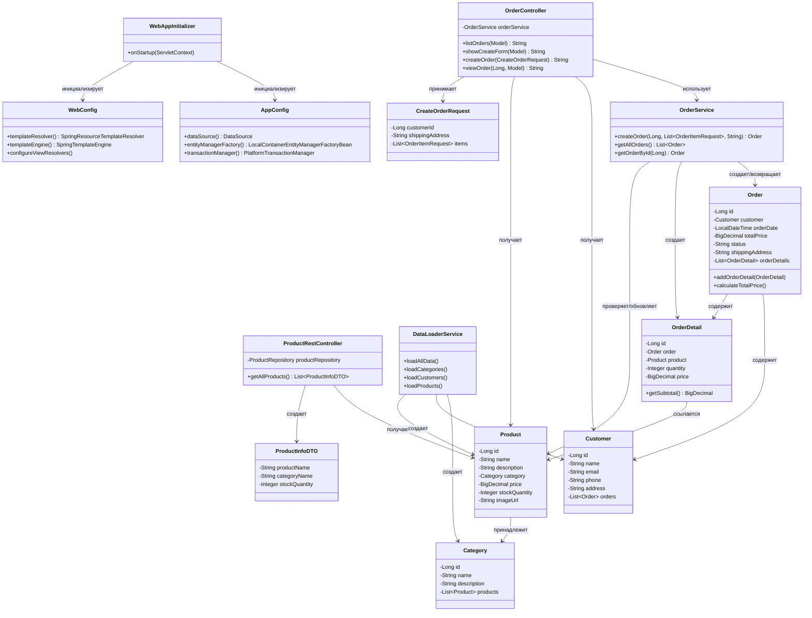

# Отчет по лабораторной работе №5
## Выполнение работы
1. Класс WebAppInitializer
```
package ru.bsuedu.cad.lab.config;

import jakarta.servlet.ServletContext;
import jakarta.servlet.ServletException;
import jakarta.servlet.ServletRegistration;
import org.springframework.web.WebApplicationInitializer;
import org.springframework.web.context.ContextLoaderListener;
import org.springframework.web.context.support.AnnotationConfigWebApplicationContext;
import org.springframework.web.servlet.DispatcherServlet;

public class WebAppInitializer implements WebApplicationInitializer {

    @Override
    public void onStartup(ServletContext servletContext) throws ServletException {
        // Корневой контекст (ваш AppConfig)
        AnnotationConfigWebApplicationContext rootContext = new AnnotationConfigWebApplicationContext();
        rootContext.register(AppConfig.class);

        servletContext.addListener(new ContextLoaderListener(rootContext));

        // Веб-контекст (WebConfig)
        AnnotationConfigWebApplicationContext webContext = new AnnotationConfigWebApplicationContext();
        webContext.register(WebConfig.class);

        ServletRegistration.Dynamic dispatcher = servletContext.addServlet("dispatcher",
                new DispatcherServlet(webContext));
        dispatcher.setLoadOnStartup(1);
        dispatcher.addMapping("/");

    }
}
```
2. Класс WebConfig
```
package ru.bsuedu.cad.lab.config;

import org.springframework.context.ApplicationContext;
import org.springframework.context.annotation.Bean;
import org.springframework.context.annotation.ComponentScan;
import org.springframework.context.annotation.Configuration;
import org.springframework.web.servlet.config.annotation.EnableWebMvc;
import org.springframework.web.servlet.config.annotation.ResourceHandlerRegistry;
import org.springframework.web.servlet.config.annotation.ViewResolverRegistry;
import org.springframework.web.servlet.config.annotation.WebMvcConfigurer;
import org.thymeleaf.spring6.SpringTemplateEngine;
import org.thymeleaf.spring6.templateresolver.SpringResourceTemplateResolver;
import org.thymeleaf.spring6.view.ThymeleafViewResolver;

@Configuration
@EnableWebMvc
@ComponentScan(basePackages = "ru.bsuedu.cad.lab.controller")
public class WebConfig implements WebMvcConfigurer {

    private final ApplicationContext applicationContext;

    public WebConfig(ApplicationContext applicationContext) {
        this.applicationContext = applicationContext;
    }

    @Bean
    public SpringResourceTemplateResolver templateResolver() {
        SpringResourceTemplateResolver resolver = new SpringResourceTemplateResolver();
        resolver.setApplicationContext(applicationContext);
        resolver.setPrefix("/WEB-INF/views/");
        resolver.setSuffix(".html");
        resolver.setTemplateMode("HTML");
        resolver.setCharacterEncoding("UTF-8");
        return resolver;
    }

    @Bean
    public SpringTemplateEngine templateEngine() {
        SpringTemplateEngine engine = new SpringTemplateEngine();
        engine.setTemplateResolver(templateResolver());
        engine.setEnableSpringELCompiler(true);
        return engine;
    }

    @Override
    public void configureViewResolvers(ViewResolverRegistry registry) {
        ThymeleafViewResolver resolver = new ThymeleafViewResolver();
        resolver.setTemplateEngine(templateEngine());
        resolver.setCharacterEncoding("UTF-8");
        resolver.setContentType("text/html;charset=UTF-8");
        registry.viewResolver(resolver);
    }

    @Override
    public void addResourceHandlers(ResourceHandlerRegistry registry) {
        registry.addResourceHandler("/resources/**")
                .addResourceLocations("/resources/");
    }
}
```
3. Класс OrderController
```
package ru.bsuedu.cad.lab.controller;

import org.slf4j.Logger;
import org.slf4j.LoggerFactory;
import org.springframework.stereotype.Controller;
import org.springframework.transaction.annotation.Transactional;
import org.springframework.ui.Model;
import org.springframework.web.bind.annotation.*;
import ru.bsuedu.cad.lab.dto.CreateOrderRequest;
import ru.bsuedu.cad.lab.entity.Customer;
import ru.bsuedu.cad.lab.entity.Order;
import ru.bsuedu.cad.lab.entity.Product;
import ru.bsuedu.cad.lab.repository.CustomerRepository;
import ru.bsuedu.cad.lab.repository.ProductRepository;
import ru.bsuedu.cad.lab.service.OrderService;

import java.util.ArrayList;
import java.util.List;

@Controller
@RequestMapping("/orders")
public class OrderController {
    private static final Logger logger = LoggerFactory.getLogger(OrderController.class);

    private final OrderService orderService;
    private final CustomerRepository customerRepository;
    private final ProductRepository productRepository;

    public OrderController(OrderService orderService,
                           CustomerRepository customerRepository,
                           ProductRepository productRepository) {
        this.orderService = orderService;
        this.customerRepository = customerRepository;
        this.productRepository = productRepository;
    }

    @GetMapping
    @Transactional(readOnly = true)
    public String listOrders(Model model) {
        List<Order> orders = orderService.getAllOrders();
        model.addAttribute("orders", orders);
        return "order-list";
    }

    @GetMapping("/new")
    @Transactional(readOnly = true)
    public String showCreateForm(Model model, @RequestParam(required = false) String error) {
        logger.info("Отображение формы создания заказа");

        List<Customer> customers = customerRepository.findAll();
        List<Product> products = productRepository.findAll();

        model.addAttribute("customers", customers);
        model.addAttribute("products", products);

        CreateOrderRequest orderRequest = new CreateOrderRequest();
        List<CreateOrderRequest.OrderItemRequest> items = new ArrayList<>();
        items.add(new CreateOrderRequest.OrderItemRequest());
        orderRequest.setItems(items);

        model.addAttribute("orderRequest", orderRequest);

        if (error != null) {
            model.addAttribute("errorMessage", "Добавьте хотя бы один товар в заказ");
        }

        return "order-form";
    }

    @PostMapping
    @Transactional
    public String createOrder(@ModelAttribute CreateOrderRequest orderRequest) {
        logger.info("Создание заказа: customerId={}, address={}",
                orderRequest.getCustomerId(), orderRequest.getShippingAddress());

        if (orderRequest.getItems() == null || orderRequest.getItems().isEmpty()) {
            logger.error("Список товаров пуст!");
            return "redirect:/orders/new?error=empty";
        }

        List<OrderService.OrderItemRequest> items = orderRequest.getItems().stream()
                .map(item -> new OrderService.OrderItemRequest(item.getProductId(), item.getQuantity()))
                .toList();

        orderService.createOrder(
                orderRequest.getCustomerId(),
                items,
                orderRequest.getShippingAddress()
        );

        return "redirect:/orders";
    }

    @GetMapping("/{id}")
    @Transactional(readOnly = true)
    public String viewOrder(@PathVariable Long id, Model model) {
        Order order = orderService.getOrderById(id);
        model.addAttribute("order", order);
        return "order-detail";
    }
}
```
4. Класс ProductRestController
```
package ru.bsuedu.cad.lab.controller;

import org.slf4j.Logger;
import org.slf4j.LoggerFactory;
import org.springframework.transaction.annotation.Transactional;
import org.springframework.web.bind.annotation.GetMapping;
import org.springframework.web.bind.annotation.RequestMapping;
import org.springframework.web.bind.annotation.RestController;
import ru.bsuedu.cad.lab.dto.ProductInfoDTO;
import ru.bsuedu.cad.lab.entity.Product;
import ru.bsuedu.cad.lab.repository.ProductRepository;

import java.util.List;
import java.util.stream.Collectors;

@RestController
@RequestMapping("/api/products")
public class ProductRestController {
    private static final Logger logger = LoggerFactory.getLogger(ProductRestController.class);

    private final ProductRepository productRepository;

    public ProductRestController(ProductRepository productRepository) {
        this.productRepository = productRepository;
    }

    @GetMapping
    @Transactional(readOnly = true)
    public List<ProductInfoDTO> getAllProducts() {
        logger.info("REST запрос: получение всех продуктов");

        List<Product> products = productRepository.findAll();
        logger.info("Найдено продуктов: {}", products.size());

        return products.stream()
                .map(product -> {
                    String productName = product.getName();

                    String categoryName = "Без категории";
                    if (product.getCategory() != null) {
                        org.hibernate.Hibernate.initialize(product.getCategory());
                        categoryName = product.getCategory().getName();
                    }

                    Integer stockQuantity = product.getStockQuantity();

                    logger.debug("Товар: {}, категория: {}", productName, categoryName);

                    return new ProductInfoDTO(productName, categoryName, stockQuantity);
                })
                .collect(Collectors.toList());
    }
}
```
5. Диаграмма классов

