# Отчет по лабораторной работе №6
## Выполнение работы
1. Класс JacksonConfig
```
package ru.bsuedu.cad.lab.config;

import com.fasterxml.jackson.databind.ObjectMapper;
import com.fasterxml.jackson.datatype.jsr310.JavaTimeModule;
import org.springframework.context.annotation.Bean;
import org.springframework.context.annotation.Configuration;

@Configuration
public class JacksonConfig {

    @Bean
    public ObjectMapper objectMapper() {
        ObjectMapper mapper = new ObjectMapper();
        mapper.registerModule(new JavaTimeModule());
        return mapper;
    }
}
```
2. Класс OrderRestController
```
package ru.bsuedu.cad.lab.controller;

import org.slf4j.Logger;
import org.slf4j.LoggerFactory;
import org.springframework.web.bind.annotation.*;
import org.springframework.transaction.annotation.Transactional;
import ru.bsuedu.cad.lab.dto.CreateOrderRequest;
import ru.bsuedu.cad.lab.entity.Order;
import ru.bsuedu.cad.lab.service.OrderService;

import java.util.List;

@RestController
@RequestMapping("/api/orders")
public class OrderRestController {

    private static final Logger logger = LoggerFactory.getLogger(OrderRestController.class);

    private final OrderService orderService;

    public OrderRestController(OrderService orderService) {
        this.orderService = orderService;
    }

    @GetMapping
    @Transactional(readOnly = true)
    public List<Order> getAllOrders() {
        logger.info("REST: получить все заказы");
        return orderService.getAllOrders();
    }

    @GetMapping("/{id}")
    @Transactional(readOnly = true)
    public Order getOrderById(@PathVariable Long id) {
        logger.info("REST: получить заказ {}", id);
        return orderService.getOrderById(id);
    }

    @PostMapping
    @Transactional
    public Order createOrder(@RequestBody CreateOrderRequest request) {
        logger.info("REST: создать заказ");

        List<OrderService.OrderItemRequest> items = request.getItems().stream()
                .map(i -> new OrderService.OrderItemRequest(i.getProductId(), i.getQuantity()))
                .toList();

        return orderService.createOrder(
                request.getCustomerId(),
                items,
                request.getShippingAddress()
        );
    }

    @DeleteMapping("/{id}")
    @Transactional
    public String deleteOrder(@PathVariable Long id) {
        logger.info("REST: удалить заказ {}", id);
        orderService.deleteOrder(id);
        return "Order deleted";
    }

    @PutMapping("/{id}")
    @Transactional
    public Order updateOrder(@PathVariable Long id,
                             @RequestParam String status) {

        logger.info("REST: обновить заказ {}", id);
        return orderService.updateOrderStatus(id, status);
    }
}
```
3. Класс ProductRestController
```
package ru.bsuedu.cad.lab.controller;

import org.slf4j.Logger;
import org.slf4j.LoggerFactory;
import org.springframework.transaction.annotation.Transactional;
import org.springframework.web.bind.annotation.GetMapping;
import org.springframework.web.bind.annotation.RequestMapping;
import org.springframework.web.bind.annotation.RestController;
import ru.bsuedu.cad.lab.dto.ProductInfoDTO;
import ru.bsuedu.cad.lab.entity.Product;
import ru.bsuedu.cad.lab.repository.ProductRepository;

import java.util.List;
import java.util.stream.Collectors;

@RestController
@RequestMapping("/api/products")
public class ProductRestController {
    private static final Logger logger = LoggerFactory.getLogger(ProductRestController.class);

    private final ProductRepository productRepository;

    public ProductRestController(ProductRepository productRepository) {
        this.productRepository = productRepository;
    }

    @GetMapping
    @Transactional(readOnly = true)
    public List<ProductInfoDTO> getAllProducts() {
        logger.info("REST запрос: получение всех продуктов");

        List<Product> products = productRepository.findAll();
        logger.info("Найдено продуктов: {}", products.size());

        return products.stream()
                .map(product -> {
                    String productName = product.getName();

                    String categoryName = "Без категории";
                    if (product.getCategory() != null) {
                        org.hibernate.Hibernate.initialize(product.getCategory());
                        categoryName = product.getCategory().getName();
                    }

                    Integer stockQuantity = product.getStockQuantity();

                    logger.debug("Товар: {}, категория: {}", productName, categoryName);

                    return new ProductInfoDTO(productName, categoryName, stockQuantity);
                })
                .collect(Collectors.toList());
    }
}
```
4. Диаграмма классов

```mermaid
classDiagram
    class Category {
        +Long id
        +String name
        +String description
        +List~Product~ products
    }

    class Customer {
        +Long id
        +String name
        +String email
        +String phone
        +String address
        +List~Order~ orders
    }

    class Product {
        +Long id
        +String name
        +String description
        +BigDecimal price
        +Integer stockQuantity
        +String imageUrl
        +LocalDateTime createdAt
        +LocalDateTime updatedAt
        +Category category
        +List~OrderDetail~ orderDetails
        +onUpdate()
    }

    class Order {
        +Long id
        +LocalDateTime orderDate
        +BigDecimal totalPrice
        +String status
        +String shippingAddress
        +Customer customer
        +List~OrderDetail~ orderDetails
        +addOrderDetail(OrderDetail)
        +removeOrderDetail(OrderDetail)
        +calculateTotalPrice()
    }

    class OrderDetail {
        +Long id
        +Integer quantity
        +BigDecimal price
        +Order order
        +Product product
        +getSubtotal() BigDecimal
    }

    class CategoryRepository {
        <<interface>>
        +save(Category) Category
        +findById(Long) Optional~Category~
        +findAll() List~Category~
    }

    class CustomerRepository {
        <<interface>>
        +save(Customer) Customer
        +findById(Long) Optional~Customer~
        +findByEmail(String) Optional~Customer~
        +findAll() List~Customer~
    }

    class ProductRepository {
        <<interface>>
        +save(Product) Product
        +findById(Long) Optional~Product~
        +findAll() List~Product~
        +findByCategoryId(Long) List~Product~
    }

    class OrderRepository {
        <<interface>>
        +save(Order) Order
        +findById(Long) Optional~Order~
        +findAll() List~Order~
        +findByCustomerId(Long) List~Order~
        +delete(Order)
    }

    class OrderDetailRepository {
        <<interface>>
        +save(OrderDetail) OrderDetail
        +findById(Long) Optional~OrderDetail~
        +findAll() List~OrderDetail~
        +findByOrderId(Long) List~OrderDetail~
    }

    class CategoryRepositoryImpl {
        +save(Category) Category
        +findById(Long) Optional~Category~
        +findAll() List~Category~
    }

    class CustomerRepositoryImpl {
        +save(Customer) Customer
        +findById(Long) Optional~Customer~
        +findByEmail(String) Optional~Customer~
        +findAll() List~Customer~
    }

    class ProductRepositoryImpl {
        +save(Product) Product
        +findById(Long) Optional~Product~
        +findAll() List~Product~
        +findByCategoryId(Long) List~Product~
    }

    class OrderRepositoryImpl {
        +save(Order) Order
        +findById(Long) Optional~Order~
        +findAll() List~Order~
        +findByCustomerId(Long) List~Order~
        +delete(Order)
    }

    class OrderDetailRepositoryImpl {
        +save(OrderDetail) OrderDetail
        +findById(Long) Optional~OrderDetail~
        +findAll() List~OrderDetail~
        +findByOrderId(Long) List~OrderDetail~
    }

    class DataLoaderService {
        +loadAllData()
        +loadCategories()
        +loadCustomers()
        +loadProducts()
    }

    class OrderService {
        +createOrder(Long, List~OrderItemRequest~, String) Order
        +getAllOrders() List~Order~
        +getOrderById(Long) Order
        +deleteOrder(Long)
        +updateOrderStatus(Long, String) Order
    }

    class OrderItemRequest {
        +Long productId
        +Integer quantity
        +OrderItemRequest(Long, Integer)
    }

    class OrderController {
        +listOrders(Model) String
        +showCreateForm(Model, String) String
        +createOrder(CreateOrderRequest) String
        +viewOrder(Long, Model) String
    }

    class OrderRestController {
        +getAllOrders() List~Order~
        +getOrderById(Long) Order
        +createOrder(CreateOrderRequest) Order
        +deleteOrder(Long) String
        +updateOrderStatus(Long, String) Order
    }

    class ProductRestController {
        +getAllProducts() List~ProductInfoDTO~
    }

    class CreateOrderRequest {
        +Long customerId
        +String shippingAddress
        +List~OrderItemRequest~ items
        +getCustomerId()
        +getShippingAddress()
        +getItems()
    }

    class ProductInfoDTO {
        +String productName
        +String categoryName
        +Integer stockQuantity
        +ProductInfoDTO(String, String, Integer)
    }

    class AppConfig {
        +dataSource() DataSource
        +entityManagerFactory() LocalContainerEntityManagerFactoryBean
        +transactionManager() PlatformTransactionManager
    }

    class WebConfig {
        +templateResolver() SpringResourceTemplateResolver
        +templateEngine() SpringTemplateEngine
        +configureViewResolvers(ViewResolverRegistry)
        +addResourceHandlers(ResourceHandlerRegistry)
    }

    class JacksonConfig {
        +objectMapper() ObjectMapper
    }

    class WebAppInitializer {
        +onStartup(ServletContext)
    }

    Category "1" --> "*" Product : has
    Customer "1" --> "*" Order : places
    Order "1" --> "*" OrderDetail : contains
    Product "1" --> "*" OrderDetail : appears in

    CategoryRepositoryImpl ..|> CategoryRepository : implements
    CustomerRepositoryImpl ..|> CustomerRepository : implements
    ProductRepositoryImpl ..|> ProductRepository : implements
    OrderRepositoryImpl ..|> OrderRepository : implements
    OrderDetailRepositoryImpl ..|> OrderDetailRepository : implements

    DataLoaderService --> CategoryRepository : uses
    DataLoaderService --> CustomerRepository : uses
    DataLoaderService --> ProductRepository : uses
    OrderService --> OrderRepository : uses
    OrderService --> OrderDetailRepository : uses
    OrderService --> CustomerRepository : uses
    OrderService --> ProductRepository : uses

    OrderController --> OrderService : uses
    OrderController --> CustomerRepository : uses
    OrderController --> ProductRepository : uses
    OrderRestController --> OrderService : uses
    ProductRestController --> ProductRepository : uses

    OrderController ..> CreateOrderRequest : creates
    OrderRestController ..> CreateOrderRequest : receives
    OrderService ..> OrderItemRequest : receives
    ProductRestController ..> ProductInfoDTO : returns
```

